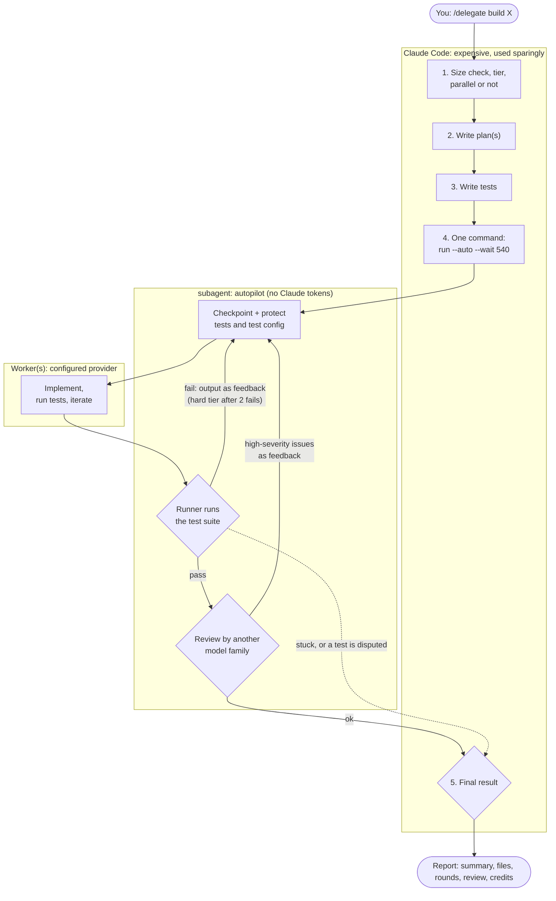
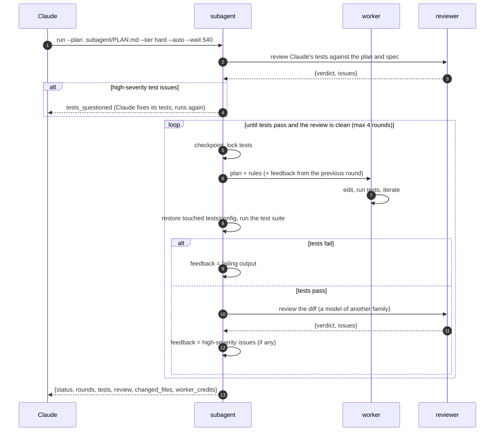
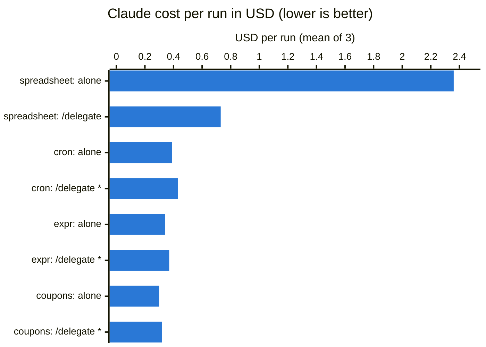

# claude-subagent-delegation

Cut Claude Code's token bill by delegating implementation work to a cheaper agent, on the
provider you already have — Codex, Copilot, GLM, DeepSeek, Grok, Gemini, or a local model
(llama.cpp, vLLM, oMLX). **Claude plans and verifies; the worker implements.** Claude writes a
plan and the tests, hands the work to a worker on the configured provider, and then only looks
at a small JSON status and the test results. It never reads the implementation, so the expensive
model spends tokens on the plan and the tests, not on code.

Two pieces, fused under one `config.toml`:

- **The delegation loop** — `subagent detect|run|wait|test|review|undo|checkpoints|watch` — the
  plan–tests–implement–review loop, driven by the `/delegate` skill.
- **The provider runtime** — an MCP server (`subagent-mcp`) exposing the same subagents as
  `delegate` / `await` / `continue` / `list` / `cancel` / `transcript` tools.

- [Install](#install)
- [Configuration](#configuration)
- [Providers](#providers)
- [The delegation loop](#the-delegation-loop)
- [subagent doctor](#subagent-doctor)
- [MCP wrapper](#mcp-wrapper)
- [Telemetry](#telemetry)
- [Benchmark results](#benchmark-results)
- [Development](#development)
- [Limitations](#limitations)
- [Credits](#credits)

---

## Install

```sh
git clone https://github.com/gaztrabisme/claude-subagent-delegation && cd claude-subagent-delegation
./install.sh                    # links the skill into ~/.claude/skills/ and installs `subagent`
subagent init                   # writes ~/.config/subagent/config.toml from the examples
```

`install.sh` is POSIX `sh`, so it runs the same from bash, zsh, fish or any other shell. It
symlinks `skills/delegate` into `~/.claude/skills/delegate`, installs the package with
`uv tool install --editable .` (when `uv` is not installed it prints the `pipx install -e .`
line instead), and prints `subagent init` as the next step.

`subagent init` is interactive; `subagent init --from glm --yes` writes one example
non-interactively, and `subagent init --from-env` converts the old `GLM_API_KEY` /
`DEEPSEEK_API_KEY` environment once. For any provider whose key is not yet in your environment
it prints the `export NAME=...` line you still need.

## Configuration

Configuration is TOML, layered — each file overrides the one before, tables merged key by key:
`~/.config/subagent/config.toml` (all projects), then `<project>/.subagent/config.toml`, then
whatever `$SUBAGENT_CONFIG` names. Eight starter examples live in `examples/`.

```toml
[core]
default_provider = "glm"

[providers.glm]
driver = "claude"
base_url = "https://api.z.ai/api/anthropic"
model = "glm-5.3-flash[1m]"
api_key_env = "GLM_API_KEY"
```

```sh
export GLM_API_KEY=...
subagent doctor                 # check every configured provider against this machine
```

`api_key_env` names the variable, never the value: keys live in the environment, not in the
file. A provider can also carry `local = true`, `max_agents`, per-provider timeouts, an
`adapter`, and `[providers.<name>.health]` / `.probe` / `.pricing` tables for local servers.

## Providers

`driver` says how the worker runs. `claude` means Claude Code pointed at any
Anthropic-compatible endpoint; the CLI drivers own their own login and connection.

| Provider | driver | The worker runs | Notes |
|---|---|---|---|
| GLM (z.ai) | `claude` | `claude -p` against z.ai's Anthropic-compatible endpoint | flat plan; `model = "glm-5.3-flash[1m]"` |
| DeepSeek | `claude` | `claude -p` against DeepSeek's Anthropic-compatible endpoint | per-token pricing |
| llama.cpp | `claude` | `claude -p` against a llama.cpp OpenAI-compatible proxy | `local = true`; `adapter = "fold_system"` when the template rejects mid-conversation system messages |
| vLLM | `claude` | `claude -p` against a vLLM OpenAI-compatible endpoint | `local = true`; literal `api_key = "local"` |
| oMLX | `claude` | `claude -p` against oMLX on localhost | `local = true`; `send_sampling = false` |
| Codex | `codex` | the Codex CLI (`codex exec --json`) | own login (`codex login`); no base_url or key |
| Copilot | `copilot` | the Copilot CLI (`copilot -p`) | own login; no guard hook, so MCP use needs `[guard].allow_unguarded = true` |
| Grok | `grok` | the Grok CLI (`grok -p`) | own login |
| Gemini | `gemini` | the Gemini CLI (`gemini -p`) | experimental: needs `experimental = true` |

## The delegation loop

Claude starts a loop from the `/delegate` skill: it first runs a **size check** (small work stays
with Claude; delegation only pays off past ~200 lines), picks a **tier** (`hard` for parsers,
graphs, concurrency, perf/security; otherwise `normal`), writes a plan and the tests, and hands
one command to the autopilot.



The tiers map to a provider (and optionally a model on it) in the config, so you can remap them
without touching the skill: `[loop.tiers.normal]` and `[loop.tiers.hard]` name a `provider`, and
`[loop.review]` / `[loop.test_writer]` name the providers for the cross-family review and the
test writer.



The loop runs entirely under the autopilot: it checkpoints the tree before each round, protects
the tests, re-runs the suite after each round, moves to the `hard` tier after two failed rounds,
and when the tests pass has a model of another family review the diff and sends high-severity
issues back. It hands back one final status — `done`, `tests_questioned`, `needs_test_change`,
`review_concerns`, `tests_failed`, or a setup error — with `rounds`, `tests`, `review` and
`changed_files`. The full status-handling playbook is in `skills/delegate/SKILL.md`; the commands
are `subagent detect|run|wait|test|review|undo|checkpoints|watch` (each prints one JSON object).

## subagent doctor

`subagent doctor` checks each configured provider against this machine: the driver's binary on
`PATH`, the API-key variables, the health gate (for local providers), and — with `--prompt` — one
cheap turn. `--provider NAME` checks one provider, `--json` prints a machine-readable row per
provider.

```sh
subagent doctor                  # every configured provider
subagent doctor --provider glm   # just one
subagent doctor --prompt --json  # also run one cheap turn on each
```

## MCP wrapper

The provider runtime is also an MCP server, `subagent-mcp`, so the same subagents are available
as tools to any MCP client. Register it in Claude Code's `~/.claude.json`:

```json
{
  "mcpServers": {
    "subagent": {
      "command": "subagent-mcp",
      "env": { "SUBAGENT_CONFIG": "/absolute/path/to/config.toml" }
    }
  }
}
```

Tools: `delegate` starts a run on a provider — `provider=` picks it (`lane=` is a deprecated
alias), and `verification=` is the command that proves the work is done, which the server runs
itself — then `await` polls it, `continue` gives more work to the same session, `list` reports
the configured `providers` and `default_provider`, `cancel` stops it, and `transcript` shows what
it did. The child's tool calls are gated by a policy classifier and a supervisor; anything the
classifier cannot settle is escalated to the caller. Point a delegation at a branch, a worktree,
or a scratch directory rather than anything you cannot afford to have edited.

## Telemetry

`[core] trace = "on"` appends one JSON line per decision and finished run (unset writes to the
session root; `off` disables it). `[pricing]` names the counterfactual Claude model. To join the
child runs to the parent Claude Code turns that issued them, and price both sides:

```sh
uv run --group report python -m subagent.telemetry.cost --out ./cost-out
```

## First measured cell (2026-09-23)

The fused tool has its first measured benchmark cell: Claude Code (the `claude` harness) ran
the cron task in delegate mode through a private config with GLM workers — one run, one worker
round, one review, all 22 hidden acceptance tests passed — and the raw outputs are in
[wiki/data/bench-2026-09-23/](wiki/data/bench-2026-09-23/). The worker's price is missing from
the table on purpose: GLM is billed as a flat monthly plan, and the accounting spreads that
month's plan over the runs recorded that month, so with a single run recorded the whole plan
($80.0 in `results.csv`'s `worker_usd`) lands on this cell and is not comparable in a
single-cell view. Counterfactual USD is what the same worker tokens would have cost on the
orchestrator's own provider; the next step is the same measurement across the matrix over
harnesses and self-hosted providers described in [docs/benchmark.md](docs/benchmark.md).

| Orchestrator | Worker provider | Task | Hidden tests | Orchestrator USD | Worker tokens in/out/cache-read | Counterfactual USD | Rounds | Reviews | Wall |
|---|---|---|---|---|---|---|---|---|---|
| claude | glm | cron | 22/22 | $0.68 | 70259 / 39062 / 1019328 | $1.8375 | 1 | 1 | 1065s |

## Benchmark results (these numbers predate the fusion)

Each task was run 3 times by Claude alone (`"Implement TASK.md"`) and 3 times with `/delegate`,
using the same Claude model (Opus 5) and tools. Quality was measured with **hidden acceptance tests**
that neither side saw. Values are means over the 3 runs (2026-09-19).



How to read it: each pair of bars is the same task, done by Claude alone and with `/delegate`.

- **spreadsheet (~1,000 lines):** the task was delegated to Copilot, and Claude's cost fell from
  $2.36 to $0.73 (-69%). With [test outlines](#test-outlines) it fell further, to $0.66.
- **\* the three small tasks (~60-200 lines):** the [size check](#when-claude-delegates-size-check)
  decided they were too small to delegate, so Claude did them itself. The few extra cents (+4-9%)
  are the cost of loading the skill and making that decision, not a loss from delegating.


| Task | Size | What `/delegate` did | Claude alone | Claude + `/delegate` | Change | Copilot credits | Hidden tests |
|---|---|---|---|---|---|---|---|
| cart-coupons (existing code) | ~60 lines | size check: Claude did it | $0.30 | $0.32 | +4% | 0 | all passed |
| expr-eval (new module) | ~200 lines | size check: Claude did it | $0.34 | $0.37 | +8% | 0 | all passed |
| cron (Python package) | ~200 lines | size check: Claude did it | $0.39 | $0.43 | +9% | 0 | all passed |
| spreadsheet (multi-module) | ~1,000 lines | delegated: 1 round, tier hard (Opus), review ok | **$2.36** | **$0.73** | **-69%** | 140 | all passed |

- **Where the savings come from: turns.** Alone, Claude took 26–43 turns on the spreadsheet, each
  re-reading a growing context (1.24M cache-read tokens on average). Delegating, it took 8–10
  (273k), because Copilot's edit-and-debug loop never enters Claude's context. Claude's output
  tokens dropped from 40.9k to 10.8k.
- **Small tasks cost a little more** because of loading the skill and making the size decision.
  Forcing delegation on cron (`/delegate force`) didn't help either: Claude cost $0.43 (+11%) plus
  about 20 Copilot credits, and it took 3.3 minutes instead of 1.
- **Time:** about the same on the spreadsheet (504s vs 490s alone).
- **Copilot credits** are listed separately: the dollar value of a credit depends on your plan.

### Autopilot (3 runs each, 2026-09-19)

| Task | Mode | Claude cost | Claude turns | Copilot credits (worker rounds) | Hidden tests |
|---|---|---|---|---|---|
| spreadsheet | delegate, before autopilot | $0.73 ($0.66–$0.80) | 9 (8–10) | 140 | 126/126 |
| spreadsheet | delegate, **autopilot** | $0.78 ($0.73–$0.85) | 8 (7–9) | 200 (126–342) | 126/126 |
| cron | force, before autopilot | $0.43 ($0.41–$0.48) | 6 | 20 | 66/66 |
| cron | force, **autopilot** | $0.50 ($0.44–$0.56) | 11 (9–13) | 78 (46–112) | 66/66 |

- **Claude's cost stayed about the same** (within the run-to-run spread). In these tasks the first
  round usually passed, so there were few retries to take off Claude's hands; Claude's cost is
  dominated by writing the plan and the tests.
- **What autopilot added was quality, paid in Copilot credits.** The cross-family review found real
  problems that the hidden tests didn't cover. In one spreadsheet run it flagged a high-severity
  issue and the worker fixed it in a second round, with no Claude turns. That fix round cost 214
  credits (a resumed Opus session carries its whole context).
- **Cron:** in 2 of 3 runs the worker correctly **disputed a wrong test Claude had written**
  (`0 0 29 2 MON` can't fire in March). The runner handed the dispute back, Claude fixed its
  test, and the rerun passed. That is where the extra Claude turns came from.
- The credits above count worker rounds only: a bug (since fixed) dropped the review's usage
  events for GPT models. A `gpt-5.6-sol` review of the spreadsheet costs ~22 credits.

### Test outlines (3 runs each)

With Claude writing a test outline instead of test code, the spreadsheet delegation cost **$0.66**
instead of $0.78 (-15%) and produced **76–95 tests instead of 13–15**. On cron, Claude's cost was
flat ($0.49 vs $0.47) because it wrote more cases, which gave 61–95 tests instead of 10–19. All
hidden tests passed. Copilot's credits rose about 45%, and runs took longer.

Details, per-run numbers, methodology and how to add tasks: [docs/benchmark.md](docs/benchmark.md).

## Development

```sh
uv run pytest -q                 # full suite; no network and no provider account needed
```

The tests run a fake Codex/Copilot and mock HTTP endpoints, so nothing reaches a real provider.
The loop's shell tests (the documented commands in bash, zsh and fish) skip shells that aren't
installed and need git, node and npm.

## Limitations

- **Tests are protected by path and known settings.** Unusual setups (a custom runner script, Rust
  inline `#[cfg(test)]` modules) are not guarded; add paths with `extra_protected`. The test-count
  check still catches a passing suite that runs fewer tests.
- **Workers run with full tools.** The loop's checkpoints make every round undoable; the MCP
  wrapper's children are gated by the policy classifier and supervisor, but either can still run
  arbitrary commands in the workspace you name.
- **Claude trusts the tests and the reviews, not the code.** The reviews catch a lot, but not
  everything. For anything important, read `git diff` yourself (it costs no Claude tokens).

## Credits

The delegation loop comes from [khangzxrr/claude-to-copilot-delegation](https://github.com/khangzxrr/claude-to-copilot-delegation); the provider runtime comes from [gaztrabisme/subagent-mcp](https://github.com/gaztrabisme/subagent-mcp).
