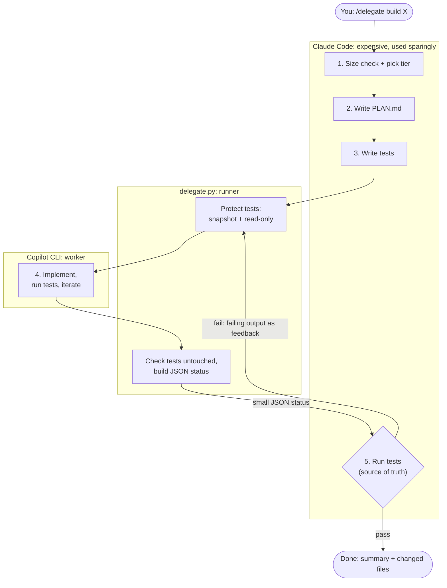
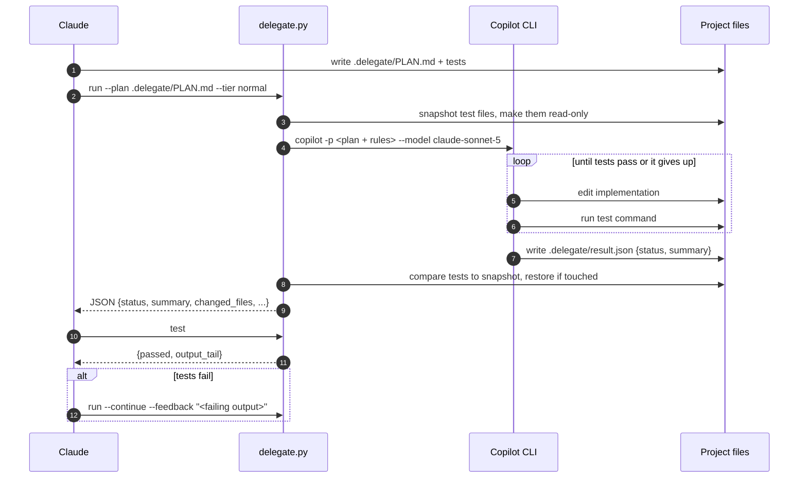
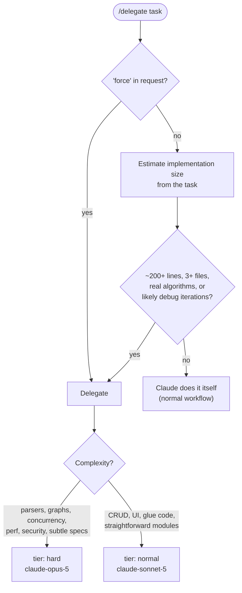
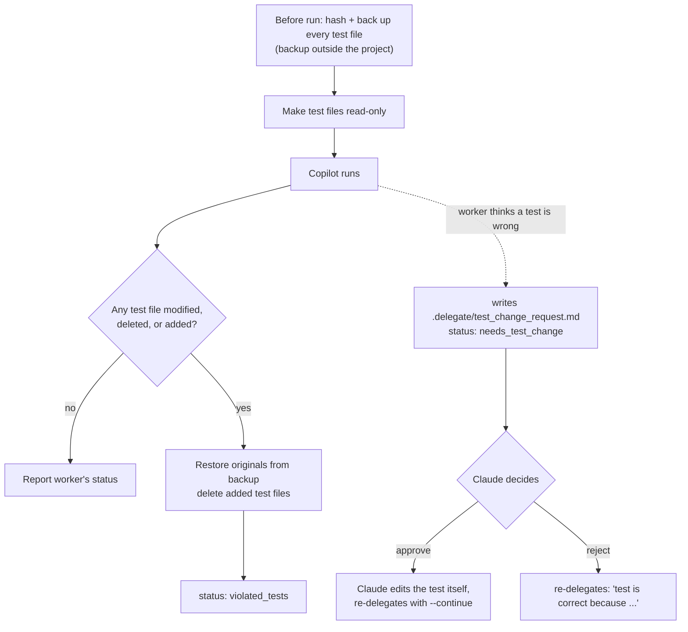
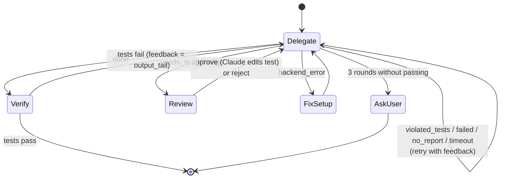
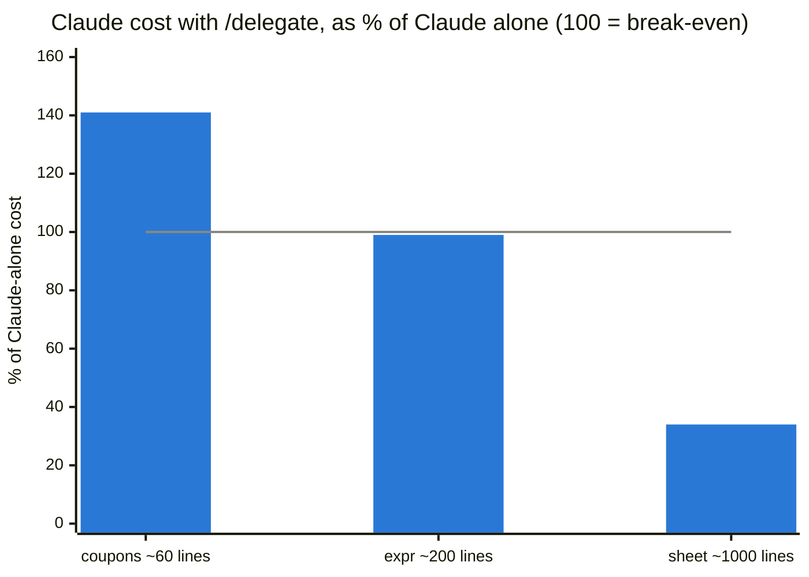

# claude-to-copilot-delegation

Cut Claude Code token usage by delegating implementation work to a cheaper coding agent
(GitHub Copilot CLI by default).

**Claude plans and verifies; the worker implements.** Claude writes a plan and the tests, hands the
work to Copilot, and then only looks at a small JSON status and the test results. It never reads the
implementation, so the expensive model spends tokens on the plan and the tests, not on code.

On a ~1,000-line task this cost **66% less Claude usage than Claude working alone, with the same
quality** (all 42 hidden acceptance tests passed in both modes). See [Benchmark results](#benchmark-results).

- [How it works](#how-it-works)
- [Quick start](#quick-start)
- [When Claude delegates: size check](#when-claude-delegates-size-check)
- [Choosing the worker model: tiers](#choosing-the-worker-model-tiers)
- [Test protection](#test-protection)
- [Run statuses and retries](#run-statuses-and-retries)
- [Configuration](#configuration)
- [Runner CLI reference](#runner-cli-reference)
- [Benchmark results](#benchmark-results)
- [Project layout](#project-layout)
- [Limitations](#limitations)

---

## How it works



What each side sees:

| | Claude | Copilot |
|---|---|---|
| Reads | task, plan, tests, a JSON status, failing test output | whole repo, plan, tests |
| Writes | `.delegate/PLAN.md`, test files | implementation code |
| Runs tests | yes: the final verdict | yes: while iterating |
| May change tests | yes (it owns them) | **no**: only by asking Claude |

One delegation round in detail:



## Quick start

Requirements: Python 3.10+, Node/Python/Go/etc. for your project's tests, and
[GitHub Copilot CLI](https://docs.github.com/copilot/how-tos/copilot-cli) logged in (`copilot login`).

```sh
git clone https://github.com/khangzxrr/claude-to-copilot-delegation.git
cd claude-to-copilot-delegation
./install.sh                    # symlinks skills/delegate -> ~/.claude/skills/delegate
```

Then, in any project (a git repo, so you can roll back), start a new Claude Code session:

```text
/delegate add a parseDuration("1h30m") -> seconds function in src/utils, throw on invalid input
```

Claude reports its decision first (for example
`Size check: ~900 lines across 5 modules → delegating (tier: hard)`), then plans, writes tests,
delegates, verifies and summarizes. Use `/delegate force ...` to skip the size check.

## When Claude delegates: size check

Delegating has a fixed cost: loading the skill, writing a plan and tests, and extra turns. It only
pays off when the implementation is large. So Claude first estimates the size of the work from the
task alone, without reading the codebase.



| Claude does it itself | Claude delegates |
|---|---|
| under ~200 lines | ~200+ lines |
| 1-2 files | 3+ files or new modules |
| bug fix, rename, config, wiring | parsers, state machines, graphs, protocols |
| plan + tests would be as long as the code | likely to need several debug iterations |

The ~200-line threshold comes from the [benchmark](#benchmark-results): about 60 lines lost money
when delegated, about 200 broke even, and about 1,000 saved 66%.

## Choosing the worker model: tiers

Claude picks a **tier**, and the config maps it to a Copilot model, so you can remap tiers without
touching the skill.

| Tier | Default model | Used for |
|---|---|---|
| `normal` | `claude-sonnet-5` | most work; the default when unsure |
| `hard` | `claude-opus-5` | complex algorithms, tricky state, perf/security, subtle specs |

- **Escalation:** after two failed `normal` rounds in a row, Claude retries with `hard`.
- **Fallback:** if the `hard` model's run exits with an error (e.g. the model is not on your plan),
  the runner retries once with the `normal` model and reports `model_fallback`.
- Opus uses more Copilot credits (about 2.5x Sonnet on a trivial prompt), which is why `normal`
  is the default.

## Test protection

The worker may **run** tests but not **change** them. The prompt tells Copilot so, and the runner
enforces it:



Which files count as tests is auto-detected from the project:

| Detected from | Test command | Protected files |
|---|---|---|
| `package.json` with a `test` script | `npm test` (or `pnpm` / `yarn` / `bun` by lock file) | `*.test.*`, `*.spec.*`, `__tests__/`, `test/`, `tests/`, jest/vitest/mocha config |
| pytest (`pyproject.toml`, `pytest.ini`, `conftest.py`, `tests/`) | `python3 -m pytest -q` (or `uv run` / `poetry run` / `.venv`) | `test_*.py`, `*_test.py`, `conftest.py`, `tests/`, `pytest.ini` |
| `go.mod` | `go test ./...` | `*_test.go`, `testdata/` |
| `Cargo.toml` | `cargo test` | `tests/` |
| `Makefile` with `test:` | `make test` | `tests/`, `test/` |

## Run statuses and retries

`delegate.py run` prints one JSON object. Claude acts on `status`:



| Status | Meaning | Claude's next step |
|---|---|---|
| `done` | worker says the tests pass | run `delegate.py test` to confirm |
| `needs_test_change` | worker thinks a test is wrong (`test_change_request` included) | approve and edit the test, or reject with a reason |
| `violated_tests` | worker touched protected tests (already reverted) | retry and remind it of the rule |
| `failed` / `no_report` / `timeout` | worker gave up, didn't report, or ran out of time | retry with `--continue` and feedback |
| `backend_error` | the CLI failed (auth, model, missing binary); `log_tail` included | fix the setup |

Example output:

```json
{
  "status": "done",
  "summary": "Implemented src/slugify.js with diacritic stripping; all 5 tests pass.",
  "worker_reported": "done",
  "changed_files": ["src/slugify.js"],
  "test_cmd": "npm test",
  "backend": "copilot",
  "tier": "normal",
  "model": "claude-sonnet-5",
  "seconds": 31,
  "log": ".delegate/logs/run-20260919-094652.log"
}
```

## Configuration

Optional `.delegate/config.json` in the target project:

```json
{
  "backend": "copilot",
  "models": { "normal": "claude-sonnet-5", "hard": "claude-opus-5" },
  "model": null,
  "timeout": 1800,
  "extra_args": [],
  "test_cmd": "npm run test:unit",
  "test_globs": ["tests/**"],
  "extra_protected": ["src/**/*.fixture.json"]
}
```

| Key | Default | Meaning |
|---|---|---|
| `backend` | `copilot` | `copilot`, or `command` for any other agent CLI |
| `models` | sonnet / opus | model per tier (`copilot help config` lists names) |
| `model` | `null` | pin one model for every tier (disables tier selection) |
| `timeout` | `1800` | seconds per worker run |
| `extra_args` | `[]` | extra flags passed to the backend CLI |
| `command` | `null` | argv for the `command` backend; the prompt is in `$DELEGATE_PROMPT`, and it must write `.delegate/result.json` |
| `test_cmd` | auto | override the detected test command |
| `test_globs` | auto | override the detected protected test paths |
| `extra_protected` | `[]` | extra protected paths on top of the detected ones |

Everything the runner writes lives in `.delegate/`, which gets its own `.gitignore`.

## Runner CLI reference

Claude runs these for you; they are also handy to run by hand.

```sh
D=~/.claude/skills/delegate/delegate.py

python3 $D detect                                    # test command, protected files, models
python3 $D run --plan .delegate/PLAN.md --tier hard  # delegate one round
python3 $D run --plan .delegate/PLAN.md --continue --feedback "2 tests fail: ..."
python3 $D test                                      # run tests: {passed, output_tail}
```

| `run` option | Meaning |
|---|---|
| `--plan FILE` | the plan given to the worker (required) |
| `--tier normal\|hard` | complexity tier, mapped to a model (default `normal`) |
| `--model NAME` | explicit model for this run, overrides tier and config |
| `--continue` | resume the previous worker session (keeps its context across retries) |
| `--feedback TEXT` / `--feedback-file PATH` | reviewer feedback for a retry |

Exit codes: `0` when `status` is `done` (or tests pass for `test`), otherwise non-zero.

## Benchmark results

The same tasks were run by Claude alone (`"Implement TASK.md"`) and by Claude + `/delegate`, with the
same model (Opus 5) and tools. Quality was measured with **hidden acceptance tests** that neither side
saw. This is one run per mode, so treat the numbers as indicative.



| Task | Implementation size | Claude alone | Claude + delegate | Change | Hidden tests (alone / delegate) |
|---|---|---|---|---|---|
| cart-coupons (existing code) | ~60 lines | $0.277 | $0.392 | **+41%** | 9/9 · 9/9 |
| expr-eval (new module) | ~200 lines | $0.400 | $0.397 | -1% | 13/13 · 13/13 |
| spreadsheet (new, multi-module) | ~1,000 lines | $2.670 | $0.895 | **-66%** | 42/42 · 42/42 |

With the size check, Claude now does cart-coupons itself: **$0.318** (vs $0.277 alone). The
remaining difference is the cost of loading the skill.

The savings come from **turns**. Working alone on the spreadsheet, Claude took 33 turns, each
re-reading a growing context (1.57M cache-read tokens). With delegation it took 10 (254k), because
Copilot's edit-and-debug loop never enters Claude's context.

| spreadsheet | Claude alone | Claude + delegate |
|---|---|---|
| Claude cost | $2.67 | $0.90 |
| Claude output tokens | 44,607 | 17,562 |
| Cache-read tokens | 1,566,536 | 253,526 |
| Claude turns | 33 | 10 |
| Wall time | 432s | 513s |
| Copilot runs | 0 | 1 |

These costs don't include Copilot's own credits. Delegate mode is also somewhat slower, because
Claude waits for Copilot.

How the benchmark works, and how to run it or add tasks: [docs/benchmark.md](docs/benchmark.md).

## Project layout

```text
claude-to-copilot-delegation/
├── install.sh                  # symlink the skill into ~/.claude/skills/
├── skills/delegate/
│   ├── SKILL.md                # the /delegate workflow Claude follows
│   └── delegate.py             # runner: detect, run (guarded), test
├── bench/
│   ├── run.py                  # benchmark harness: alone vs delegate
│   ├── tasks/<name>/repo/      # starting project + TASK.md
│   ├── tasks/<name>/hidden/    # acceptance tests, never shown to agents
│   └── results/<timestamp>/    # summary.md, results.json, each run's working copy
└── docs/benchmark.md
```

## Limitations

- **Tests are protected by path only.** Rust inline `#[cfg(test)]` modules and test settings inside
  `pyproject.toml` / `package.json` are not guarded. Add paths with `extra_protected`.
- **The worker runs with `--allow-all-tools`.** Use a git repo or a worktree so you can roll back.
- **Claude trusts the tests, not the code.** Since it never reads the implementation, weak tests mean
  weak verification. Review with `git diff` yourself (it costs no Claude tokens), or ask Claude for a
  review when it matters.
- **Copilot CLI's account may differ from `gh`'s.** Check model availability with
  `copilot -p "reply ok" --model <name>`, not the GitHub API.
