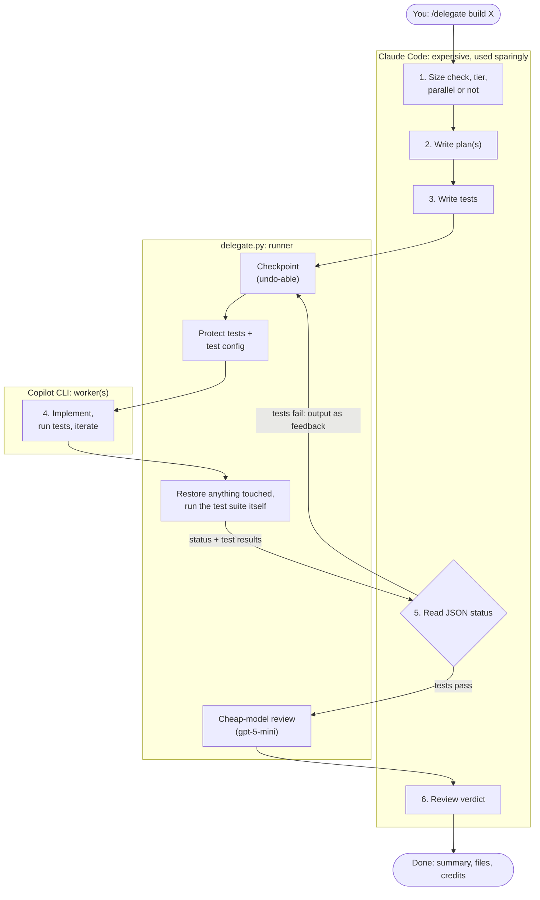
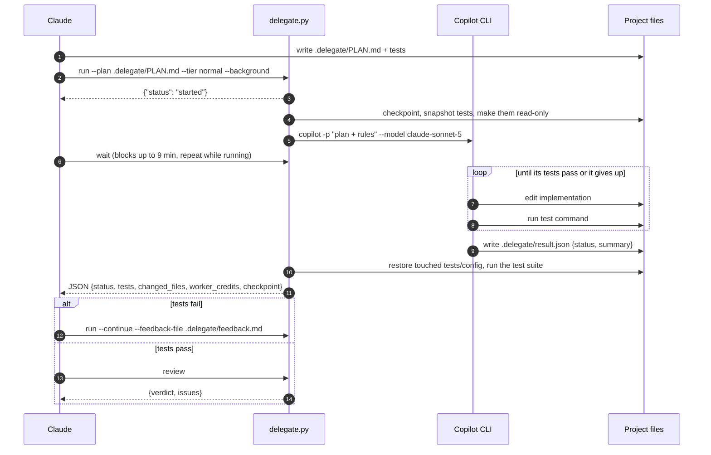
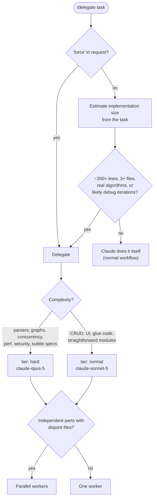
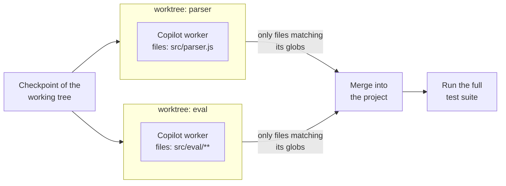
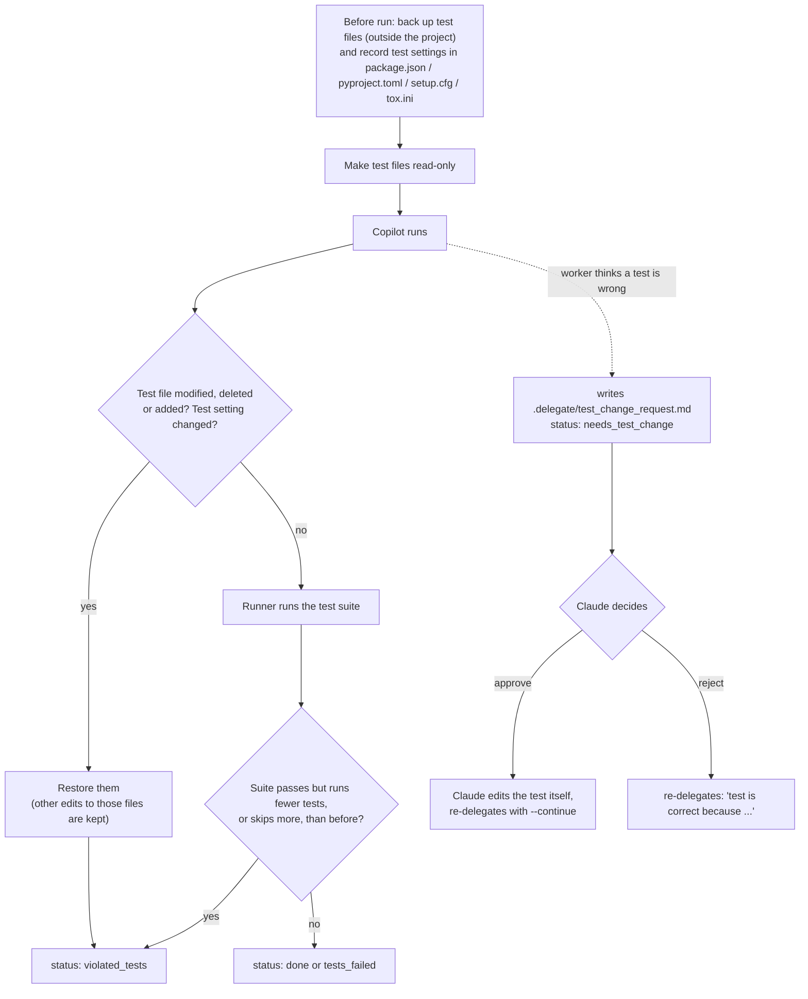
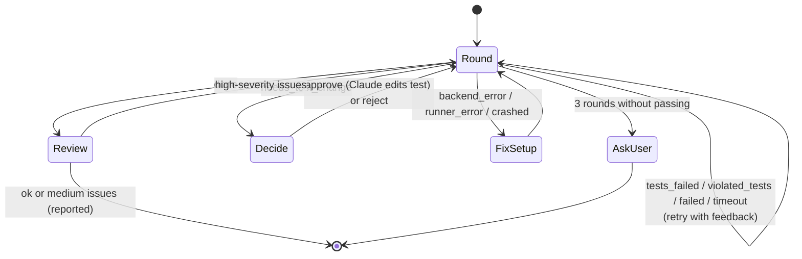
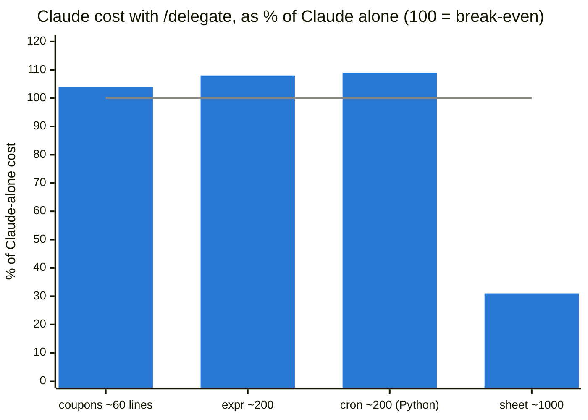

# claude-to-copilot-delegation

Cut Claude Code token usage by delegating implementation work to a cheaper coding agent
(GitHub Copilot CLI by default).

**Claude plans and verifies; the worker implements.** Claude writes a plan and the tests, hands the
work to Copilot, and then only looks at a small JSON status and the test results. It never reads the
implementation, so the expensive model spends tokens on the plan and the tests, not on code.

On a ~1,000-line task, delegating cut Claude's cost by **69%** ($2.36 → $0.73 per run, averaged
over 3 runs) with the same quality: every run passed all 42 hidden acceptance tests. On small tasks
the size check keeps the work with Claude, costing 4–9% more than not using the skill at all. See
[Benchmark results](#benchmark-results).

- [How it works](#how-it-works)
- [Quick start](#quick-start)
- [When Claude delegates: size check](#when-claude-delegates-size-check)
- [Choosing the worker model: tiers](#choosing-the-worker-model-tiers)
- [Parallel workers](#parallel-workers)
- [Background runs](#background-runs)
- [Checkpoints and undo](#checkpoints-and-undo)
- [Test protection](#test-protection)
- [Review](#review)
- [Watching Copilot live](#watching-copilot-live)
- [Run statuses and retries](#run-statuses-and-retries)
- [Configuration](#configuration)
- [Runner CLI reference](#runner-cli-reference)
- [Benchmark results](#benchmark-results)
- [Project layout](#project-layout)
- [Limitations](#limitations)

---

## How it works



What each side sees:

| | Claude | Copilot |
|---|---|---|
| Reads | task, plan, tests, a JSON status, failing test output, review issues | whole repo, plan, tests |
| Writes | `.delegate/PLAN.md`, test files | implementation code |
| Runs tests | no need: the runner runs them after each round | yes: while iterating |
| May change tests | yes (it owns them) | **no**: only by asking Claude |

One delegation round in detail:



## Quick start

Requirements: Python 3.10+, git (recommended), the tools for your project's tests, and
[GitHub Copilot CLI](https://docs.github.com/copilot/how-tos/copilot-cli) logged in (`copilot login`).

```sh
git clone https://github.com/khangzxrr/claude-to-copilot-delegation.git
cd claude-to-copilot-delegation
./install.sh                    # links the skill into ~/.claude/skills/ and a `delegate` command into ~/.local/bin/
```

`install.sh` is POSIX `sh`, so it runs the same from bash, zsh, fish or any other shell. Every
command in this README also works unchanged in all three.

Then, in any project, start a new Claude Code session:

```text
/delegate add a parseDuration("1h30m") -> seconds function in src/utils, throw on invalid input
```

Claude reports its decision first (for example
`Size check: ~900 lines, 5 modules → delegating (tier: hard, 2 parallel workers)`), then plans,
writes tests, delegates, verifies, gets a review and summarizes. Use `/delegate force ...` to skip
the size check.

## When Claude delegates: size check

Delegating has a fixed cost: loading the skill, writing a plan and tests, and extra turns. It only
pays off when the implementation is large. So Claude first estimates the size of the work from the
task alone, without reading the codebase.



| Claude does it itself | Claude delegates |
|---|---|
| under ~200 lines | ~200+ lines |
| 1-2 files | 3+ files or new modules |
| bug fix, rename, config, wiring | parsers, state machines, graphs, protocols |
| plan + tests would be as long as the code | likely to need several debug iterations |

## Choosing the worker model: tiers

Claude picks a **tier**, and the config maps it to a Copilot model, so you can remap tiers without
touching the skill.

| Tier | Default model | Used for |
|---|---|---|
| `normal` | `claude-sonnet-5` | most work; the default when unsure |
| `hard` | `claude-opus-5` | complex algorithms, tricky state, perf/security, subtle specs |

- **Escalation:** after two failed `normal` rounds in a row, Claude retries with `hard`.
- **Fallback:** if the `hard` model's run exits with an error (e.g. the model is not on your plan),
  the runner retries once with the `normal` model and reports `model_fallback`.
- Copilot bills per token in AI credits. On a trivial prompt Opus cost about 2.5x Sonnet, and
  `gpt-5-mini` (used for reviews) about 1/30 of Sonnet.

## Parallel workers

When the work splits into parts with disjoint files and clear interfaces (for example tokenizer /
parser / evaluator), Claude can run several workers at once. Each works in its own **git worktree**
(a separate checkout outside the project), so they cannot step on each other.



Claude writes one plan per part and a manifest:

```json
{"tasks": [
  {"name": "parser", "plan": ".delegate/plans/parser.md", "files": ["src/parser.js", "src/tokenizer.js"],
   "tier": "hard", "test_cmd": "node --test test/parser.test.js"},
  {"name": "eval", "plan": ".delegate/plans/eval.md", "files": ["src/eval/**"]}
]}
```

- A worker's changes outside its `files` are **discarded** and listed as `out_of_scope_files`.
  If two parts change the same file, the second is reported under `conflicts`.
- Dependency folders (`node_modules`, `.venv`, `venv`) are linked into each worktree, so tests run
  without reinstalling.
- Each part should have its own test file(s) importing only that part (`test_cmd`), because the
  other parts don't exist in its worktree.
- Parallel rounds need a git repository.

## Background runs

A worker round can take longer than Claude Code's 10-minute limit on a single command. So Claude
starts rounds in the background and collects the result with `wait`:

```sh
delegate run --plan .delegate/PLAN.md --background   # {"status": "started", "run_id": ...}
delegate wait --timeout 540                          # the result, or {"status": "running"}
```

Only one run per project can be active; a second `run` returns `busy`. If the runner process dies,
`wait` returns `crashed` with the end of its output.

## Checkpoints and undo

Before every round (and before `undo` and `review`) the runner saves a **checkpoint** of the
working tree. `undo` restores one:

```sh
delegate checkpoints          # list them
delegate undo                 # back to before the last round
delegate undo --to 20260919   # back to a specific checkpoint (id or prefix)
```

- In a git repository a checkpoint is a commit object built from a temporary index and kept under
  `refs/delegate/checkpoints/`. **Your branch, staging area and stash are never touched.** Ignored
  files (e.g. `node_modules`) are not included.
- Outside git it is a tarball in `.delegate/checkpoints/`.
- `undo` itself takes a checkpoint first, so an undo can be undone (`redo_checkpoint`).
- In a monorepo, only the project folder is checkpointed and restored.
- The last 20 checkpoints are kept (`keep_checkpoints`).

## Test protection

The worker may **run** tests but not **change** them. The prompt tells Copilot so, and the runner
enforces it:



- **Test settings:** `scripts.test`, `jest`, `mocha`, `ava`, `c8`, `nyc` in `package.json`, and the
  pytest sections of `pyproject.toml`, `setup.cfg` and `tox.ini`. Only those parts are restored; a
  dependency the worker added to `package.json` stays.
- **Test count:** the runner remembers the highest test count seen for the current set of test
  files. A passing suite that runs fewer tests, or skips more, is a violation. The history resets
  when Claude changes the tests. A failing suite is never flagged (a crash can hide tests).

Which files count as tests, and how the count is read, is auto-detected:

| Detected from | Test command | Protected files |
|---|---|---|
| `package.json` with a `test` script | `npm test` (or `pnpm` / `yarn` / `bun` by lock file) | `*.test.*`, `*.spec.*`, `__tests__/`, `test/`, `tests/`, jest/vitest/mocha config |
| pytest (`pyproject.toml`, `pytest.ini`, `conftest.py`, `tests/`) | `python3 -m pytest -q` (or `uv run` / `poetry run` / `.venv`); **`python3 -m unittest discover` when pytest isn't installed** | `test_*.py`, `*_test.py`, `conftest.py`, `tests/`, `pytest.ini` |
| `go.mod` | `go test -v ./...` | `*_test.go`, `testdata/` |
| `Cargo.toml` | `cargo test` | `tests/` |
| `Makefile` with `test:` | `make test` | `tests/`, `test/` |

Test counts are parsed from node:test, jest, vitest, mocha, pytest, unittest, go test and cargo output.

## Review

Since Claude never reads the code, weak tests could let bad code through. After the tests pass,
Claude runs a **review by a cheap model** (`gpt-5-mini` by default, about 1 AI credit):

```sh
delegate review    # {"verdict": "ok" | "concerns", "issues": [{severity, file, line, issue}]}
```

- The reviewer sees a diff of all implementation changes since the task started (tests excluded).
- It reports only security problems, clearly wrong behavior, and test-gaming, not style.
- It must not edit files; if it does, the runner restores them and says so in `note`.
- Claude sends `high` issues back to the worker as another round and includes `medium` ones in its
  report.

## Watching Copilot live

The runner streams Copilot's JSON events and turns them into a readable log as they arrive, at
`.delegate/logs/latest.log`. Claude only receives the final JSON, so watching costs no Claude tokens.
Parallel workers are interleaved with a `[name]` prefix.

```text
=== delegate run 2026-09-19 11:25:29 · tier normal · new session · checkpoint 20260919-112529-8e70
=== model: claude-sonnet-5
11:25:42 ▸ create src/slugify.js
11:25:42   ✗ create failed: Parent directory does not exist
11:25:46 ▸ bash mkdir -p src
11:25:49 ▸ create src/slugify.js
11:25:52 ▸ bash cd . && npm test
         │ ok 1 - lowercases and joins with dashes
11:25:55 💬 All 5 tests pass.
=== runner: running the test suite
=== end: done · 29s · 1 files changed · AI credits 6.80
```

- **A window per run (automatic):** set `"live_view": "auto"` in `~/.config/delegate/config.json`.
  Each run opens a terminal that follows its log and waits for Enter when it finishes. `auto` uses a
  tmux split when inside tmux, otherwise `$TERMINAL`, then the first of alacritty, kitty, wezterm,
  ghostty, foot, konsole, gnome-terminal or xterm that is installed. Or give an argv with a `{cmd}`
  placeholder: `"live_view": ["konsole", "--hold", "-e", "{cmd}"]`.
- **A terminal you open yourself:** `delegate watch` in the project follows the latest run and
  switches to each new one (Ctrl-C to stop).

To suppress windows for one command, set `DELEGATE_LIVE_VIEW=off` in its environment, e.g.
`env DELEGATE_LIVE_VIEW=off delegate run ...` (works in every shell; the benchmark does this).

## Run statuses and retries



| Status | Meaning | Claude's next step |
|---|---|---|
| `done` | the runner's test run passed | review |
| `tests_failed` | the runner's test run failed (`tests.output_tail`) | retry with the output as feedback |
| `needs_test_change` | worker thinks a test is wrong (`test_change_request`) | approve and edit the test, or reject |
| `violated_tests` | tests or test config touched (restored), or fewer tests ran | retry and name the violation |
| `failed` / `no_report` / `timeout` | worker gave up, didn't report, or ran out of time | retry with `--continue` |
| `backend_error` / `runner_error` / `crashed` | setup problem (`log_tail` / `error`) | fix the setup |
| `started` / `running` / `busy` | background bookkeeping | keep calling `wait` |

Example (single round):

```json
{
  "status": "done",
  "summary": "Implemented src/slugify.js with diacritic stripping; all 5 tests pass.",
  "worker_reported": "done",
  "changed_files": ["src/slugify.js"],
  "tests": {"passed": true, "cmd": "npm test", "counts": {"total": 5, "passed": 5, "failed": 0, "skipped": 0}},
  "tier": "normal",
  "model": "claude-sonnet-5",
  "seconds": 29,
  "checkpoint": "20260919-112529-8e70",
  "log": ".delegate/logs/run-20260919-112529.log",
  "worker_credits": 6.8,
  "run_id": "20260919-112529-1f3a"
}
```

Other fields that can appear: `model_fallback`, `violations`, `test_change_request`, `log_tail`,
`live_view_error`, `warning`; parallel rounds add `tasks` (per worker: `status`, `applied_files`,
`out_of_scope_files`, `conflicts`, `worker_credits`, ...).

## Configuration

Settings are read from `~/.config/delegate/config.json` (all projects), then from the project's
`.delegate/config.json`, which wins. Everything is optional.

| Key | Default | Meaning |
|---|---|---|
| `backend` | `copilot` | `copilot`, or `command` for any other agent CLI |
| `models` | `{"normal": "claude-sonnet-5", "hard": "claude-opus-5"}` | model per tier (`copilot help config` lists names) |
| `model` | `null` | pin one model for every tier (disables tier selection) |
| `timeout` | `1800` | seconds per worker run |
| `builtin_mcps` | `false` | keep Copilot's built-in GitHub MCP server (workers don't need it; off saves about 7% per request) |
| `extra_args` | `[]` | extra flags passed to the backend CLI |
| `command` | `null` | argv for the `command` backend; the prompt is in `$DELEGATE_PROMPT`, and it must write `.delegate/result.json` |
| `test_cmd` | auto | override the detected test command |
| `test_globs` | auto | override the detected protected test paths |
| `extra_protected` | `[]` | extra protected paths on top of the detected ones |
| `count_tests` | `true` | flag a passing suite that runs fewer tests than before |
| `review_model` | `gpt-5-mini` | model for `review` |
| `keep_checkpoints` | `20` | how many checkpoints to keep |
| `live_view` | `null` | `"auto"` opens a terminal following each run's live log; or an argv containing `"{cmd}"` |

Everything the runner writes lives in `.delegate/`, which gets its own `.gitignore`.

## Runner CLI reference

Claude runs these for you; they are also handy by hand. Every command prints one JSON object.
`delegate` is the command `install.sh` links into `~/.local/bin/`; if that isn't on your `PATH`,
use `python3 ~/.claude/skills/delegate/delegate.py` instead (same arguments, any shell).

```sh
delegate detect                                             # test command, protected files, models, git
delegate run --plan .delegate/PLAN.md --tier hard --background
delegate run --parallel .delegate/parallel.json --background
delegate wait --timeout 540
delegate run --plan .delegate/PLAN.md --continue --feedback-file .delegate/feedback.md
delegate test                                               # run the suite: {passed, counts, output_tail}
delegate review                                             # cheap-model review of the task's changes
delegate checkpoints                                        # list checkpoints
delegate undo                                               # restore the one before the last round
delegate watch                                              # follow the live log
```

| `run` option | Meaning |
|---|---|
| `--plan FILE` / `--parallel MANIFEST` | one worker on a plan, or several on a manifest |
| `--tier normal\|hard` | complexity tier, mapped to a model (default `normal`; per task in a manifest) |
| `--model NAME` | explicit model for this run, overrides tier and config |
| `--continue` | resume the previous worker session(s) (keeps their context across retries) |
| `--feedback-file PATH` / `--feedback TEXT` | feedback for a retry. Prefer a file (`-` reads stdin): test output full of quotes, `$` and backticks passes through untouched in any shell |
| `--background` | return immediately; collect the result with `wait` |

Exit codes: `0` for `done`/`started`, `3` for `running` (from `wait`), otherwise non-zero.

**Shells.** The runner never goes through your interactive shell: workers, git, background runs and
live-view terminals are started directly. The one exception is the test command, which always
runs with `/bin/sh` (so `test_cmd` in the config should be POSIX `sh` syntax).

## Benchmark results

Each task was run 3 times by Claude alone (`"Implement TASK.md"`) and 3 times with `/delegate`,
using the same Claude model (Opus 5) and tools. Quality was measured with **hidden acceptance tests**
that neither side saw. Values are means over the 3 runs (2026-09-19).



| Task | Size | What `/delegate` did | Claude alone | Claude + `/delegate` | Change | Copilot credits | Hidden tests |
|---|---|---|---|---|---|---|---|
| cart-coupons (existing code) | ~60 lines | size check: Claude did it | $0.30 | $0.32 | +4% | 0 | all passed |
| expr-eval (new module) | ~200 lines | size check: Claude did it | $0.34 | $0.37 | +8% | 0 | all passed |
| cron (Python package) | ~200 lines | size check: Claude did it | $0.39 | $0.43 | +9% | 0 | all passed |
| spreadsheet (multi-module) | ~1,000 lines | delegated: 1 round, tier hard (Opus), review ok | **$2.36** | **$0.73** | **-69%** | 140 | all passed |

- **Where the savings come from: turns.** Alone, Claude took 26–43 turns on the spreadsheet, each
  re-reading a growing context (1.24M cache-read tokens on average). Delegating, it took 8–10
  (273k), because Copilot's edit-and-debug loop never enters Claude's context. Claude's output
  tokens dropped from 40.9k to 10.8k.
- **Small tasks cost a little more** because of loading the skill and making the size decision.
  Forcing delegation on cron (`/delegate force`) didn't help either: Claude cost $0.43 (+11%) plus
  about 20 Copilot credits, and it took 3.3 minutes instead of 1.
- **Time:** about the same on the spreadsheet (504s vs 490s alone).
- **Copilot credits** are listed separately: the dollar value of a credit depends on your plan.

Details, per-run numbers, methodology and how to add tasks: [docs/benchmark.md](docs/benchmark.md).

## Project layout

```text
claude-to-copilot-delegation/
├── install.sh                  # POSIX sh: links the skill + a `delegate` command
├── skills/delegate/
│   ├── SKILL.md                # the /delegate workflow Claude follows
│   ├── delegate.py             # CLI: run (single/parallel/background), wait, test, review, undo, watch
│   ├── common.py               # config, file hashing, git helpers
│   ├── detect.py               # test framework detection, test counts, test-config fragments
│   ├── guard.py                # test protection
│   ├── checkpoint.py           # checkpoints, undo, worktrees
│   └── livelog.py              # live log, worker process runner, live-view terminals
├── bench/
│   ├── run.py                  # benchmark harness: alone vs delegate
│   ├── tasks/<name>/repo/      # starting project + TASK.md
│   ├── tasks/<name>/hidden/    # acceptance tests, never shown to agents
│   └── results/<timestamp>/    # summary.md, results.json, each run's working copy
└── docs/benchmark.md
```

## Limitations

- **Tests are protected by path and known settings.** Rust inline `#[cfg(test)]` modules and
  unusual test setups (e.g. a custom runner script) are not guarded; add paths with `extra_protected`.
  The test-count check still catches a passing suite that runs fewer tests.
- **The worker runs with `--allow-all-tools`.** Checkpoints make every round undoable, but workers
  can still run arbitrary commands on your machine.
- **Claude trusts the tests, not the code.** The cheap review catches obvious problems; for anything
  important, read `git diff` yourself (it costs no Claude tokens).
- **Copilot CLI's account may differ from `gh`'s.** Check model availability with
  `copilot -p "reply ok" --model <name>`, not the GitHub API.
