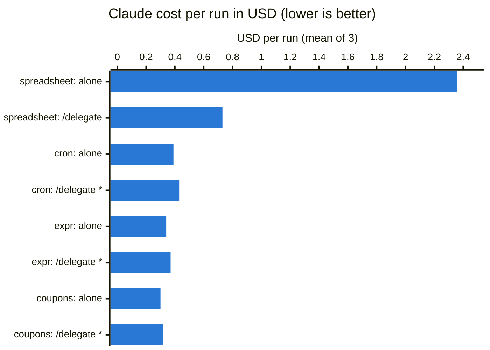

# subagent

`subagent` hands implementation work to a configured AI coding worker, runs the project's
checks, asks a different model family to review the tests and changes, and reports the result
with per-provider usage and cost. The orchestrator writes the plan and test outline; the worker
implements in rounds. Failed checks and high-severity review findings go back to the worker for
another round.

A goal file adds user acceptance checks to that loop. The runner checks executable rows against
the final workspace and sends prose rows to the configured reviewer. A tool-call guard classifies
worker actions on drivers that support it; checkpoints and the test runner provide additional
protection during the delegation loop.

## Install

Python 3.11 or later and `uv` are required. From a checkout of this repository, install the CLI
and MCP server:

```sh
uv tool install --editable .
```

Run `subagent init` to create a starter configuration. From the project where you want to use the
tool, run `subagent install --for` with your coding harness:

```sh
subagent init
subagent install --for claude
```

`--for` accepts `claude`, `codex`, `gemini`, or `copilot`. The installer adds the `/delegate`
skill, native `/plan` and `/goal` prompts, and a project-scoped MCP registration named
`subagent`. Run it from the project root or pass `--target-dir DIR`. `--timeout SECONDS` sets the
MCP timeout; `--force` replaces installer-managed files and the `subagent` registration while
preserving unrelated configuration. Install the matching harness separately and sign in to it as
usual.

## Configure providers

A provider is a worker configuration: a driver plus a model endpoint or CLI login. There are no
built-in worker accounts; `subagent init` starts from the examples in this checkout and detects
installed `claude`, `codex`, `copilot`, `gemini`, and `grok` CLIs by checking whether their
executables are on `PATH`. Detection does not launch a CLI or contact a service. The wizard lets
you choose detected CLIs and example providers. `--yes` writes without prompts and includes all
detected CLIs; `--from EXAMPLE` selects a seed, `--path PATH` changes the config destination, and
`--force` overwrites an existing destination.

If you want to add an example provider that is not already configured, select it as the
default, and check it:

```sh
subagent provider add glm --from glm
subagent provider list
subagent use glm
subagent provider test glm --prompt
```

`provider list` marks the current default; add `--json` for structured output. `--project` on
provider mutations and `subagent use` writes the project setting. `provider remove NAME` removes
a provider, but the current default must be changed with `subagent use` first. `provider add`
accepts `--force` to replace an existing provider table without replacing unrelated settings.

For an opt-in Claude Code login worker, configure a Claude provider with `auth = "login"` and no
`api_key_env`:

```toml
[providers.claude]
driver = "claude"
auth = "login"

[providers.claude.pricing]
kind = "flat_plan"
```

The worker uses the owner's existing Claude login. `subagent doctor` warns about the shared
history and quota; select it with `subagent use claude`. See [Limitations](#limitations).

To discover a local OpenAI-compatible or oMLX endpoint, set `LOCAL_LLM_BASE_URL` to its base URL
and run:

```sh
subagent provider add local --url "$LOCAL_LLM_BASE_URL"
subagent use local
```

Local discovery makes bounded read-only requests to the supplied URL to identify a model and
health endpoint. It does not start or wake the server. The new provider uses the `omp` driver.

Configuration layers merge in this order: the user config selected by `XDG_CONFIG_HOME` (or the
standard config directory when unset), `.subagent/config.toml` in the project, then the file named
by `SUBAGENT_CONFIG`. Later layers override earlier values. API keys belong in environment
variables; config stores their names in `api_key_env`, never their values. To check providers and
configuration, run:

```sh
subagent doctor
```

`subagent doctor --provider NAME` checks one provider; `--prompt` also runs a small provider turn,
`--no-probe` checks config and binaries only, and `--json` returns structured results.

## The delegation workflow

Use `/delegate` for implementation work. The installed skill checks `[loop].auto`, detects the
test command and protected test files, then prepares the plan and tests before starting a worker.
The test outline can be turned into test files and reviewed against the plan. A configured worker
receives the plan and test contract, edits the workspace, and can run tests. After each worker
round, `subagent` restores protected test files if needed, runs the verification command, and
asks a reviewer from another model family to inspect passing changes. Test failures and
high-severity review findings become feedback for the next round. The loop returns a result with
status, changed files, tests, review findings, rounds, and worker credits or cost.

`[loop].auto` defaults to `ask`: `ask` requests approval before an automatically triggered
delegation, `always` starts the workflow without that extra prompt, and `never` keeps the work
with the orchestrator. An explicit `/delegate` request starts the workflow. You can run the loop
from a terminal as well:

```sh
subagent run --plan .subagent/PLAN.md --goal GOAL.md --auto --wait 540
```

Run `uv run subagent --help` for the command list. The installed harness integration is the
usual path; individual loop commands are available for manual workflows.

## Goal files

`/plan` writes a plan that ends with a `## Goal block`; `/goal` writes a workspace-root
`GOAL.md` containing only that block. A goal can also be supplied inline to `subagent run --goal`.
The required block has a plan reference followed by consecutive numbered rows:

```text
## Goal block
Execute plan "Add CSV export" (PLAN.md). Goal rows:
1 tests: `uv run pytest -q`
2 output format: The CSV has a header and one row for each exported record.
```

A row has the form `<number> <label>: <check>`. A check wrapped in exactly one pair of inline
backticks is a command; a check with no backticks is prose for the reviewer. Mixed command and
prose text in one check is rejected. Blank lines between rows are allowed. The parser requires
row numbers to start at 1 without gaps, and the extracted block may be at most 4,000 characters.
A goal file must be UTF-8 and inside the selected workspace; its path is protected from worker
writes. Validate a block or file before running it with:

```sh
subagent doctor --goal GOAL.md
```

Command rows run on the server after the final worker round, in the selected workspace. The guard
uses the existing verification command classifier and adds no goal-specific allowlist. It can
allow safe read-only commands such as `cat`, `grep`, `rg`, and `test`; read-only Git commands such
as `git status` and `git diff`; test/build runners such as `pytest`, `tox`, `nose2`, `unittest`,
`make`, `cargo`, and `go`; and recognized forms such as `uv run pytest`, subject to argument and
path checks. Commands such as `uv run ruff check`, `uv build --wheel`, shell substitution, or
arbitrary interpreter snippets are not generally allowed. Only an `ALLOW` verdict executes a
command. A denied or escalated check is blocked without calling a supervisor, recorded as failed,
and leaves the run `completed_unverified`; a command passes only on exit code zero. Timeouts and
execution errors fail the check. The result
includes each UAT row and a bounded output tail. Prose rows go to the configured cross-family
reviewer; without a reviewer verdict they remain pending. Prose review does not replace command
checks. A goal with only prose has no server-side goal check, which `doctor --goal` reports.

## Configuration and usage records

The main loop settings live in `[loop]`:

- `auto` is `ask`, `always`, or `never` (default `ask`).
- `test_output_cap` is an optional positive character limit for test output copied into worker
  feedback. The full output remains in its log; without this setting, the loop uses its existing
  30-line tail.
- `parallel_tool_calls` defaults to `false`; setting it to `true` asks the worker to batch
  independent model tool calls in one turn. It does not set the number of concurrent workers;
  `[core].max_agents` does that.
- `no_narration` defaults to `false`; setting it to `true` asks the worker to return
  implementation results without progress narration.
- `delegate_test_writer` defaults to `false`; setting it to `true` routes a supplied
  `--test-outline FILE` to
  `[loop.test_writer].provider` and reviews the generated tests before execution. It requires a
  configured test writer and `[loop].review_tests = true`; the outline flag is still the trigger.

`[core].compact_window` and `[providers.NAME].compact_window` are token counts for Claude context
compaction. The default is 1,000,000 tokens; a provider value overrides the core value. Provider
`thinking` accepts `off` or `low`, but support depends on the driver: `omp` supports both; `codex`
and `antigravity` support `low`. Unsupported combinations use the driver's default and produce a
doctor warning. `[core].chars_per_token` defaults to `3.5` and controls source-token estimates.

Turn records retain the provider's input, output, cache, and reasoning totals. They also add
`source_usage` for visible `harness_prompt`, `plan`, `tool_results`, and `test_output` input
characters and estimated tokens, plus provider-reported output and reasoning tokens under
`model_output`. Input estimates use `round(characters / chars_per_token)`. An `unmeasured` list
identifies sources a driver cannot observe; for example, the current Codex translator does not
expose tool-result text. These source estimates describe content visible to `subagent`; they do
not split hidden provider system text or replace provider-reported totals.

View per-provider and per-delegation usage and cost in a self-contained HTML report:

```sh
subagent report --html report.html
```

The report uses configured pricing and provider usage, including credits where reported. A flat
subscription with no monthly price remains an unknown cash cost rather than an invented dollar
amount.

## First measured cell (2026-09-23)

The fused tool has its first measured benchmark cell: Claude Code (the `claude` harness) ran
the cron task in delegate mode through a private config with GLM workers — one run, one worker
round, one review, all 22 hidden acceptance tests passed — and the raw outputs are in
[wiki/data/bench-2026-09-23/](wiki/data/bench-2026-09-23/). The worker's price is missing from
the table on purpose: GLM is billed as a flat monthly plan, and the accounting spreads that
month's plan over the runs recorded that month, so with a single run recorded the whole plan
($80.0 in `results.csv`'s `worker_usd`) lands on this cell and is not comparable in a
single-cell view. Counterfactual USD is what the same worker tokens would have cost on the
orchestrator's own provider; the next step is the same measurement across the matrix over
harnesses and self-hosted providers described in [docs/benchmark.md](docs/benchmark.md).

| Orchestrator | Worker provider | Task | Hidden tests | Orchestrator USD | Worker tokens in/out/cache-read | Counterfactual USD | Rounds | Reviews | Wall |
|---|---|---|---|---|---|---|---|---|---|
| claude | glm | cron | 22/22 | $0.68 | 70259 / 39062 / 1019328 | $1.8375 | 1 | 1 | 1065s |

## Benchmark results (these numbers predate the fusion)

Each task was run 3 times by Claude alone (`"Implement TASK.md"`) and 3 times with `/delegate`,
using the same Claude model (Opus 5) and tools. Quality was measured with **hidden acceptance tests**
that neither side saw. Values are means over the 3 runs (2026-09-19).


```mermaid
---
config:
  themeVariables:
    xyChart:
      plotColorPalette: "#2a78d6"
---
xychart-beta horizontal
    title "Claude cost per run in USD (lower is better)"
    x-axis ["spreadsheet: alone", "spreadsheet: /delegate", "cron: alone", "cron: /delegate *", "expr: alone", "expr: /delegate *", "coupons: alone", "coupons: /delegate *"]
    y-axis "USD per run (mean of 3)" 0 --> 2.5
    bar [2.36, 0.73, 0.39, 0.43, 0.34, 0.37, 0.30, 0.32]
```

How to read it: each pair of bars is the same task, done by Claude alone and with `/delegate`.

- **spreadsheet (~1,000 lines):** the task was delegated to Copilot, and Claude's cost fell from
  $2.36 to $0.73 (-69%). With [test outlines](#test-outlines) it fell further, to $0.66.
- **\* the three small tasks (~60-200 lines):** the [size check](#when-claude-delegates-size-check)
  decided they were too small to delegate, so Claude did them itself. The few extra cents (+4-9%)
  are the cost of loading the skill and making that decision, not a loss from delegating.


| Task | Size | What `/delegate` did | Claude alone | Claude + `/delegate` | Change | Copilot credits | Hidden tests |
|---|---|---|---|---|---|---|---|
| cart-coupons (existing code) | ~60 lines | size check: Claude did it | $0.30 | $0.32 | +4% | 0 | all passed |
| expr-eval (new module) | ~200 lines | size check: Claude did it | $0.34 | $0.37 | +8% | 0 | all passed |
| cron (Python package) | ~200 lines | size check: Claude did it | $0.39 | $0.43 | +9% | 0 | all passed |
| spreadsheet (multi-module) | ~1,000 lines | delegated: 1 round, tier hard (Opus), review ok | **$2.36** | **$0.73** | **-69%** | 140 | all passed |

- **Where the savings come from: turns.** Alone, Claude took 26–43 turns on the spreadsheet, each
  re-reading a growing context (1.24M cache-read tokens on average). Delegating, it took 8–10
  (273k), because Copilot's edit-and-debug loop never enters Claude's context. Claude's output
  tokens dropped from 40.9k to 10.8k.
- **Small tasks cost a little more** because of loading the skill and making the size decision.
  Forcing delegation on cron (`/delegate force`) didn't help either: Claude cost $0.43 (+11%) plus
  about 20 Copilot credits, and it took 3.3 minutes instead of 1.
- **Time:** about the same on the spreadsheet (504s vs 490s alone).
- **Copilot credits** are listed separately: the dollar value of a credit depends on your plan.

### Autopilot (3 runs each, 2026-09-19)

| Task | Mode | Claude cost | Claude turns | Copilot credits (worker rounds) | Hidden tests |
|---|---|---|---|---|---|
| spreadsheet | delegate, before autopilot | $0.73 ($0.66–$0.80) | 9 (8–10) | 140 | 126/126 |
| spreadsheet | delegate, **autopilot** | $0.78 ($0.73–$0.85) | 8 (7–9) | 200 (126–342) | 126/126 |
| cron | force, before autopilot | $0.43 ($0.41–$0.48) | 6 | 20 | 66/66 |
| cron | force, **autopilot** | $0.50 ($0.44–$0.56) | 11 (9–13) | 78 (46–112) | 66/66 |

- **Claude's cost stayed about the same** (within the run-to-run spread). In these tasks the first
  round usually passed, so there were few retries to take off Claude's hands; Claude's cost is
  dominated by writing the plan and the tests.
- **What autopilot added was quality, paid in Copilot credits.** The cross-family review found real
  problems that the hidden tests didn't cover. In one spreadsheet run it flagged a high-severity
  issue and the worker fixed it in a second round, with no Claude turns. That fix round cost 214
  credits (a resumed Opus session carries its whole context).
- **Cron:** in 2 of 3 runs the worker correctly **disputed a wrong test Claude had written**
  (`0 0 29 2 MON` can't fire in March). The runner handed the dispute back, Claude fixed its
  test, and the rerun passed. That is where the extra Claude turns came from.
- The credits above count worker rounds only: a bug (since fixed) dropped the review's usage
  events for GPT models. A `gpt-5.6-sol` review of the spreadsheet costs ~22 credits.

### Test outlines (3 runs each)

With Claude writing a test outline instead of test code, the spreadsheet delegation cost **$0.66**
instead of $0.78 (-15%) and produced **76–95 tests instead of 13–15**. On cron, Claude's cost was
flat ($0.49 vs $0.47) because it wrote more cases, which gave 61–95 tests instead of 10–19. All
hidden tests passed. Copilot's credits rose about 45%, and runs took longer.

Details, per-run numbers, methodology and how to add tasks: [docs/benchmark.md](docs/benchmark.md).

## Limitations

- **Guard coverage depends on the driver.** The loop still checkpoints work and verifies tests,
  but tool-call protection differs:

  | Driver | Tool-call protection |
  |---|---|
  | Claude (`claude`) | PreToolUse hook with the subagent classifier. |
  | Codex (`codex`) | Classifier hook plus Codex `workspace-write` sandbox. |
  | Copilot (`copilot`) | No guard hook. Direct MCP worker use requires `[guard].allow_unguarded = true`. |
  | Grok (`grok`) | Built-in sandbox by default; uses Grok's native hook path when configured. |
  | Oh My Pi (`omp`) | Packaged tool-call hook reaches the subagent classifier. |
  | Gemini (`gemini`) | No tool-call guard; runs with `--yolo` and is experimental. |
  | Antigravity (`antigravity`) | No installed approval hook; relies on its CLI sandbox and is experimental. |

  With `[guard].supervisor = "off"`, Codex's hook is disabled but its sandbox remains.

- **Windows is unsupported.**
- **Claude login uses the owner's account.** The opt-in Claude provider setting `auth = "login"`
  uses the owner's Claude login and plan quota. Worker sessions are written into the owner's
  Claude history. The owner's global instructions, commands, and skills may also load in that
  worker; `subagent doctor` warns when it checks this provider.
- Workers edit the workspace you give them. The loop checkpoints work and protects detected test
  files, but review and tests cannot guarantee that every defect is found. Inspect important
  changes before relying on them.
