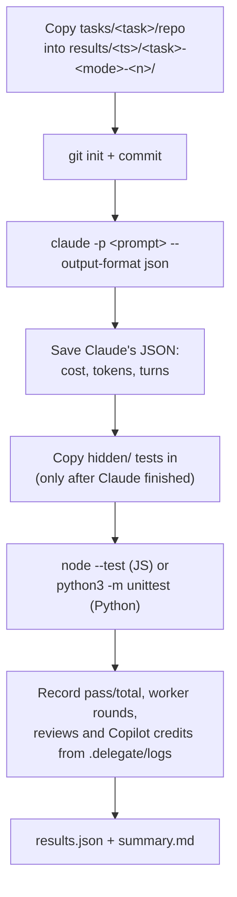
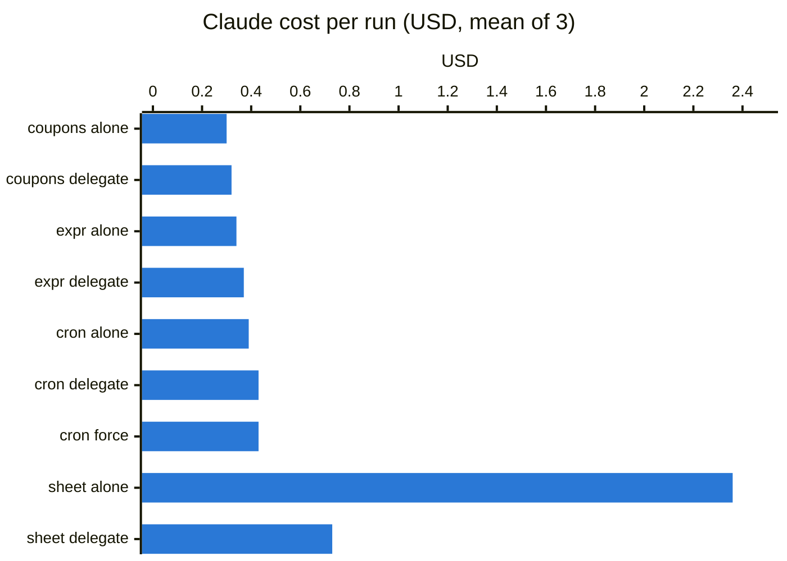

# Benchmark: Claude alone vs Claude + delegate

`bench/run.py` runs the same tasks in several modes and compares Claude's cost, tokens, time,
Copilot credits and quality.

| Mode | Prompt given to `claude -p` |
|---|---|
| `alone` | `Implement the task described in TASK.md in this repository. Verify your work before finishing.` |
| `delegate` | `/delegate Implement the task described in TASK.md in this repository.` (the size check decides) |
| `force` | `/delegate force Implement the task described in TASK.md in this repository.` (always delegates) |

All modes use the same Claude model (your Claude Code default unless `--model` is given), the same
tools (`Bash Read Edit Write Glob Grep Skill`) and `--permission-mode acceptEdits`. Live-view windows
are turned off (`DELEGATE_LIVE_VIEW=off`).

## How one run works



The hidden tests are copied in only after the agent is done, so no mode can see them or tailor the
code to them. They measure whether the result actually meets the spec in `TASK.md`.

## Running it

```sh
python3 bench/run.py                                   # all tasks, alone + delegate, 1 run each
python3 bench/run.py --runs 3 --jobs 4                 # what produced the results below
python3 bench/run.py --tasks cron --modes force --runs 3
python3 bench/run.py --model sonnet                    # a different Claude model for all modes
```

| Option | Default | Meaning |
|---|---|---|
| `--tasks` | all | task names under `bench/tasks/` |
| `--modes` | `alone delegate` | any of `alone`, `delegate`, `force` |
| `--runs` | `1` | runs per task and mode |
| `--jobs` | `1` | parallel runs (timing gets noisier with more) |
| `--model` | Claude Code default | Claude model for all modes |
| `--timeout` | `2400` | seconds per Claude run |

Every run uses Claude usage, and every run that delegates also uses Copilot credits.

## Output

`bench/results/<timestamp>/`:

| File | Content |
|---|---|
| `summary.md` | per task and mode: means with (min–max), then a per-run table |
| `results.json` | one record per run (fields below) |
| `<task>-<mode>-<n>/` | the run's working copy: inspect with `git diff`, `.delegate/logs/` |
| `<task>-<mode>-<n>.claude.json` | Claude's raw `--output-format json` result |
| `<task>-<mode>-<n>.hidden.txt` | hidden test output |

| Field | Source |
|---|---|
| `cost_usd` | `total_cost_usd` from Claude (API-equivalent cost) |
| `input_tokens`, `cache_write_tokens`, `cache_read_tokens`, `output_tokens` | Claude's `usage` |
| `turns` | `num_turns` |
| `wall_seconds` | measured by the harness (includes waiting for Copilot) |
| `worker_rounds`, `reviews` | `=== end` lines in `.delegate/logs/*.log` |
| `worker_credits` | Copilot AI credits, summed from those `=== end` lines (rounds and reviews) |
| `hidden_passed`, `hidden_total` | parsed from the hidden test output |
| `permission_denials` | tool calls Claude was not allowed to make |

A solution that fails to import reports a single failing test, so the summary uses the task's full
hidden test count as the denominator.

## Tasks

| Task | Language | Kind | Size of a typical solution | Hidden tests |
|---|---|---|---|---|
| `cart-coupons` | JS | add a feature to an existing small codebase | ~60 lines | 9 |
| `expr-eval` | JS | new module: arithmetic expression evaluator | ~200 lines | 13 |
| `cron` | Python | new package: cron expression parser and scheduler | ~200 lines | 22 |
| `spreadsheet` | JS | new multi-module engine: parser, evaluator, dependency graph, cycles, row insertion, change events | ~1,000 lines | 42 |

Every task's hidden tests were validated against a reference implementation kept out of the repo.
The cron tests were also cross-checked against a second, minute-by-minute brute-force implementation
on 400 random expressions.

## Results (2026-09-19, Opus 5, 3 runs per task and mode)



Means, with (min–max) over 3 runs:

| Task | Mode | Hidden tests | Claude cost | Copilot credits | Claude output tokens | Turns | Wall time |
|---|---|---|---|---|---|---|---|
| cart-coupons | alone | 27/27 | $0.30 ($0.28–$0.32) | 0 | 3,420 | 5 | 34s |
| cart-coupons | delegate | 27/27 | $0.32 ($0.29–$0.33) | 0 | 2,960 | 6 | 31s |
| expr-eval | alone | 39/39 | $0.34 ($0.33–$0.34) | 0 | 4,604 | 6 | 43s |
| expr-eval | delegate | 39/39 | $0.37 ($0.35–$0.37) | 0 | 4,616 | 6 | 43s |
| cron | alone | 66/66 | $0.39 ($0.37–$0.40) | 0 | 5,817 | 5 | 55s |
| cron | delegate | 66/66 | $0.43 ($0.39–$0.45) | 0 | 5,738 | 6 | 52s |
| cron | force | 66/66 | $0.43 ($0.41–$0.48) | 20.2 (16.5–22.5) | 5,628 | 6 | 197s |
| spreadsheet | alone | 126/126 | $2.36 ($2.02–$2.59) | 0 | 40,910 | 32 (26–43) | 490s |
| spreadsheet | delegate | 126/126 | **$0.73 ($0.66–$0.80)** | 140 (132–147) | 10,843 | 9 (8–10) | 504s |

What happened in the delegate runs:

- **cart-coupons, expr-eval, cron:** the size check kept all 9 runs with Claude. No Copilot was used.
- **spreadsheet:** all 3 runs delegated to one worker on the `hard` tier (claude-opus-5). Each passed
  on the first round (Claude's own 13–14 tests), and each review came back `ok` (1.4–2.6 credits).
  Claude did not choose parallel workers: the modules depend closely on each other.
- **cron force:** one `normal` worker (claude-sonnet-5), one round, plus a review, each run.

### Takeaways

- **Large tasks: -69% Claude cost**, the same quality, about the same time. Claude's turns drop from
  ~32 to ~9, and cache-read tokens from 1.24M to 273k per run.
- **Small tasks: +4–9%**, the cost of loading the skill and deciding. Forcing delegation on a
  ~200-line task didn't save anything (+11%) and added ~20 Copilot credits and 2.5 minutes.
- **Quality was the same in every run** (all hidden tests passed in all 27 runs).
- The Claude-side cost of delegating on the spreadsheet fell from $0.90 (single run before this
  version) to $0.73, mostly because the skill now asks for concise tests and the runner re-runs the
  tests itself (no separate verification turn).

## Autopilot (3 runs each, 2026-09-19)

| Task | Mode | Claude cost | Claude turns | Copilot credits (worker rounds) | Hidden tests |
|---|---|---|---|---|---|
| spreadsheet | delegate, before autopilot | $0.73 ($0.66–$0.80) | 9 (8–10) | 140 | 126/126 |
| spreadsheet | delegate, **autopilot** | $0.78 ($0.73–$0.85) | 8 (7–9) | 200 (126–342) | 126/126 |
| cron | force, before autopilot | $0.43 ($0.41–$0.48) | 6 | 20 | 66/66 |
| cron | force, **autopilot** | $0.50 ($0.44–$0.56) | 11 (9–13) | 78 (46–112) | 66/66 |

- **Claude's cost stayed about the same** (within the run-to-run spread). In these tasks the first
  round usually passed, so there were few retries to take off Claude's hands; Claude's cost is
  dominated by writing the plan and the tests.
- **What autopilot added was quality, paid in Copilot credits.** The cross-family review found real
  problems that the hidden tests didn't cover. In one spreadsheet run it flagged a high-severity
  issue and the worker fixed it in a second round, with no Claude turns. That fix round cost 214
  credits (a resumed Opus session carries its whole context).
- **Cron:** in 2 of 3 runs the worker correctly **disputed a wrong test Claude had written**
  (`0 0 29 2 MON` can't fire in March). The runner handed the dispute back, Claude fixed its
  test, and the rerun passed. That is where the extra Claude turns came from.
- The credits above count worker rounds only: a bug (since fixed) dropped the review's usage
  events for GPT models. A `gpt-5.6-sol` review of the spreadsheet costs ~22 credits.

The runs are in `bench/results/20260919-160324` (spreadsheet) and `20260919-160329` (cron).

## Test review (cron, forced delegation, 3 runs each)

| Version | Claude cost | Turns | Copilot credits | Rounds per run |
|---|---|---|---|---|
| autopilot, no test review | $0.50 ($0.44–$0.56) | 11 | 78 | 1–2, plus 2 test disputes |
| test review v1 (missing tests could block) | $0.60 ($0.52–$0.73) | 13 | 135 | 1–5 |
| **test review v2** (only wrong tests block; sharper prompt) | **$0.47 ($0.44–$0.49)** | **8** | **63** | **1** |

- v1 missed Claude's wrong test (`0 0 29 2 1` expected on a Monday in January) and blocked another
  run over a missing test that didn't matter.
- v2 was checked directly on the three original test files with that mistake: it flagged the wrong
  test with the correct expected value in 5 of 6 attempts (23–34 credits each), with no false alarms.
- In the v2 benchmark batch Claude didn't happen to write that test, so no run was blocked; each run
  needed one worker round.

Runs: `bench/results/20260919-211537` (v1), `20260919-213028` (v2).

## Test outlines (3 runs each)

Claude writes a one-line-per-case outline; a Copilot test writer (`claude-sonnet-5`) writes the tests.

| Task | Tests written by | Claude cost | Claude output tokens | Tests in the suite | Copilot credits | Time |
|---|---|---|---|---|---|---|
| spreadsheet | Claude (autopilot) | $0.78 ($0.73–$0.85) | 12,406 | 13–15 | 200 | 555s |
| spreadsheet | **outline + test writer** | **$0.66 ($0.60–$0.74)** | 10,182 | **76–95** | 293 | 760s |
| cron (force) | Claude (test review v2) | $0.47 ($0.44–$0.49) | 6,183 | 10–19 | 63 | 304s |
| cron (force) | **outline + test writer** | $0.49 ($0.48–$0.50) | 6,633 | **61–95** | 107 | 345s |

- **Spreadsheet: -15% Claude cost.** Outlines are cheaper per test than test code.
- **Cron: no saving**, because Claude wrote many more cases (39–60 outline lines instead of 10–19
  tests). There the saving became coverage.
- **Tests: 5-6x more** in both tasks, all hidden tests still passed (126/126, 66/66).
- **The fix pass worked on a real mistake:** in one cron run Claude's outline again expected
  `0 0 29 2 MON` on a Monday outside February. The test review flagged it, and the test writer
  corrected it against the spec (Monday 2025-02-03) and explained why in `notes`, with no Claude turn.
- **Copilot pays for it:** +45% credits on the spreadsheet (the test writer, and a worker that has
  to pass 5-6x more tests) and runs took longer.

Runs: `bench/results/20260919-235149` (spreadsheet), `20260919-235155` (cron).

## Earlier single-run results (before size check and the later runner features)

| Task | Claude alone | Claude + delegate (always delegated) |
|---|---|---|
| cart-coupons | $0.277 | $0.392 (+41%) |
| expr-eval | $0.400 | $0.397 (-1%) |
| spreadsheet | $2.670 | $0.895 (-66%) |

## Adding a task

```text
bench/tasks/<name>/
├── repo/            # starting project; must contain TASK.md (and package.json for JS tasks)
│   └── TASK.md      # the spec every mode receives
└── hidden/          # acceptance tests: *.test.js (node --test) or test_*.py (unittest)
```

1. Write `repo/TASK.md` precisely enough that the hidden tests have exactly one correct answer.
2. Write the hidden tests. JS tests run from the project root with `node --test`, so import from
   `../src/...`. Python tests are copied into a `_hidden_tests/` package and run with
   `python3 -m unittest discover -s _hidden_tests -t .`, so import the project's modules directly.
3. Validate them against a reference solution in a temporary copy (not in `repo/`).
4. Run `python3 bench/run.py --tasks <name>`.
