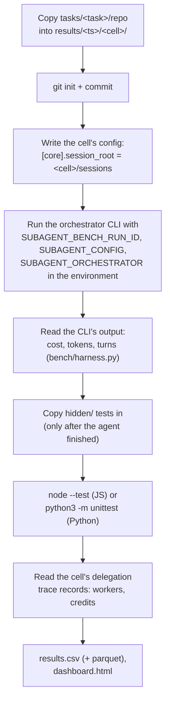
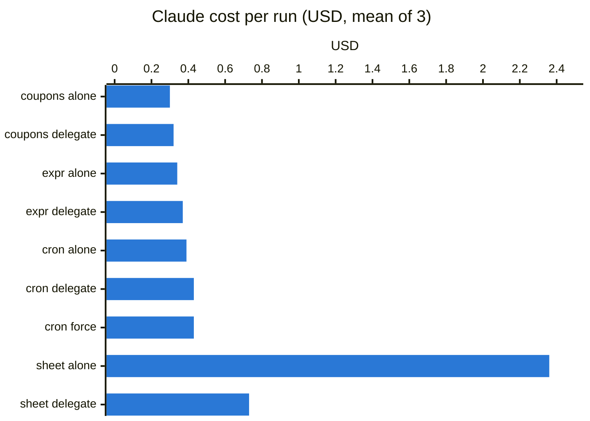

# Benchmark: orchestrator × config × task

`bench/run.py` runs a matrix of benchmark cells: every combination of an
orchestrator harness (the CLI you delegate from), a subagent config (the
worker backend), a task, a mode and a run. For each cell it records the
orchestrator's cost and tokens, the workers' tokens and credits, and whether
the result passes hidden tests the agents never saw.

```sh
python3 bench/run.py --harness claude --config examples/config.glm.toml \
    --tasks cron --modes alone --runs 1 --dry-run     # print the cells, run nothing
python3 bench/run.py --harness claude --tasks cron --modes alone --runs 1
python3 bench/run.py --harness claude codex --tasks cron spreadsheet --runs 3 --jobs 2
python3 bench/run.py --harness claude --config examples/config.glm.toml examples/config.ds.toml
```

| Option | Default | Meaning |
|---|---|---|
| `--harness` | `claude` | orchestrator CLIs, any of `claude codex gemini grok copilot` (only `claude`, `codex` and `grok` are installed here) |
| `--config` | `examples/config.glm.toml` | subagent config TOMLs; the worker backend each cell delegates through |
| `--tasks` | all | task names under `bench/tasks/` |
| `--modes` | `alone delegate` | `alone`, `delegate` (the size check decides), `force` (always delegate) |
| `--runs` | `1` | runs per harness × config × task × mode |
| `--jobs` | `1` | parallel cells (timing gets noisier with more) |
| `--model` | each CLI's own default | model for the orchestrator |
| `--timeout` | `2400` | seconds per cell |
| `--out` | `bench/results/<ts>` | output directory |
| `--dry-run` | off | print the cells and their command lines, run nothing |

## Modes and prompts

Each mode is a prompt given to the orchestrator, per harness:

| Mode | claude | codex, gemini, grok, copilot |
|---|---|---|
| `alone` | Implement the task described in TASK.md … Verify your work before finishing. | the same |
| `delegate` | `/delegate Implement the task …` (the size check decides) | Implement the task … Delegate the implementation with the delegate skill: run `subagent run …` per skills/delegate/SKILL.md |
| `force` | `/delegate force Implement the task …` (always delegates) | the same instruction, plus *you must delegate* |

The prompts live in `bench/harness.py` (`DELEGATE_PROMPTS`), next to one
`Orchestrator` per harness, which knows how to build each CLI's command line
(`argv`) and how to read its output (`parse`): claude's
`--output-format json` result (`total_cost_usd`, `usage`, `modelUsage`,
`num_turns`, `session_id`), codex's `exec --json` JSONL (usage on the last
`turn.completed`, `input_tokens` including the cached part; no USD), gemini's
`stats.models.<m>.tokens`, grok's `sessionId` (usage and cost read
defensively), copilot's JSONL with `session.usage_checkpoint.totalNanoAiu`.

## How one cell works



Each cell is isolated:

- its own working copy (fresh `git init`, so `git diff` shows what the agent
  did), named `<harness>-<config>-<task>-<mode>-<run>`;
- its own session root, written as a copy of the chosen config with
  `[core].session_root` pointed inside the cell — delegation traces can never
  interleave between cells;
- `SUBAGENT_BENCH_RUN_ID=<cell id>` in the environment, so every trace record
  the cell produces carries the cell's id, and `SUBAGENT_ORCHESTRATOR` names
  the harness for the delegation records.

The hidden tests are copied in only after the agent is done, so no mode can
see them or tailor the code to them. They measure whether the result actually
meets the spec in `TASK.md`.

## Output

`bench/results/<timestamp>/`:

| File | Content |
|---|---|
| `results.csv` | one row per cell, the columns below |
| `results.parquet` | the same rows, when pandas is importable |
| `results.json` | the same rows, as they finished |
| `summary.md` | means with (min–max) per group, then a per-cell table |
| `dashboard.html` | `subagent report` over the cells' traces (skipped, with a log line, if the report fails) |
| `<cell>/` | the cell's working copy: inspect with `git diff`, `sessions/` for traces |
| `<cell>.<harness>.out` | the orchestrator's raw output |
| `<cell>.hidden.txt` | hidden test output |

`results.csv` columns:

| Column | Source |
|---|---|
| `cell` | `<harness>-<config>-<task>-<mode>-<run>` |
| `harness`, `config`, `task`, `mode`, `run` | the matrix factors |
| `hidden_passed`, `hidden_total` | parsed from the hidden test output |
| `orch_cost_usd` | the orchestrator's own cost figure (`total_cost_usd` for claude and grok; codex and copilot report none) |
| `orch_tokens_in`, `orch_tokens_out`, `orch_tokens_cache` | the orchestrator's usage; cache is read + write. Claude's sums come from `modelUsage`, which includes subagent tokens; codex's input is reported uncached so cache reads are not counted twice |
| `orch_turns` | the orchestrator's turn count (`num_turns` for claude) |
| `worker_provider` | the provider of the worker round that ran last, from the cell's `delegation` trace records |
| `worker_tokens_in/out/cache` | the delegation records' `usage_total`, summed |
| `worker_credits` | the delegation records' `credits_total` (Copilot AI credits) |
| `worker_usd` | the delegation records' `cost_total.provider_usd` |
| `counterfactual_usd` | `cost_total.counterfactual_usd`: what the same worker tokens would have cost on the orchestrator's own provider |
| `rounds`, `reviews` | worker rounds and reviews, from the delegation records |
| `verified_pass` | the delegation record's verdict on the worker's own tests |
| `wall_s` | wall seconds for the orchestrator run, measured by the bench |

A record missing a field (an older trace, a changed schema) becomes an empty
column, never a failed run.

**API-equivalent** means: a USD figure for tokens that were not billed as API
calls. Claude's `total_cost_usd` is API-equivalent when Claude Code runs on a
subscription, and the delegation records' `counterfactual_usd` is
API-equivalent for the workers, whose real cost was credits or a local GPU.
Comparing `orch_cost_usd + counterfactual_usd` against `orch_cost_usd` alone
is the business case for delegating.

## The concurrency bench

`bench/concurrency.py` (moved from `scripts/bench_concurrency.py`) answers a
different question: how many children one local provider can serve at once.
It starts 1, 2, 4, 8 children (`--levels`) on one provider (`--provider`,
default: the config's default provider) and writes `bench.csv` (one row per
level: aggregate tok/s, TTFT median/p90, peak memory and swap, failures) and
`bench_children.csv` (per child: TTFT, wall, decode tok/s, verified), plus
the `max_agents` recommendation with the rule that decided it:

```sh
uv run python bench/concurrency.py --provider omlx --levels 1,2,4,8 --out /tmp/bench
```

## Tasks

| Task | Language | Kind | Size of a typical solution | Hidden tests |
|---|---|---|---|---|
| `cart-coupons` | JS | add a feature to an existing small codebase | ~60 lines | 9 |
| `expr-eval` | JS | new module: arithmetic expression evaluator | ~200 lines | 13 |
| `cron` | Python | new package: cron expression parser and scheduler | ~200 lines | 22 |
| `meeting-scribe` | Python | new package: transcription post-processor from a ~250-line spec | ~400 lines | 41 |
| `spreadsheet` | JS | new multi-module engine: parser, evaluator, dependency graph, cycles, row insertion, change events | ~1,000 lines | 42 |

Every task's hidden tests were validated against a reference implementation kept out of the repo.
The cron tests were also cross-checked against a second, minute-by-minute brute-force implementation
on 400 random expressions.

## Adding a task

```text
bench/tasks/<name>/
├── repo/            # starting project; must contain TASK.md (and package.json for JS tasks)
│   └── TASK.md      # the spec every mode receives
└── hidden/          # acceptance tests: *.test.js (node --test) or test_*.py (unittest)
```

1. Write `repo/TASK.md` precisely enough that the hidden tests have exactly one correct answer.
2. Write the hidden tests. JS tests run from the project root with `node --test`, so import from
   `../src/...`. Python tests are copied into a `_hidden_tests/` package and run with
   `python3 -m unittest discover -s _hidden_tests -t .`, so import the project's modules directly.
3. Validate them against a reference solution in a temporary copy (not in `repo/`).
4. Run `python3 bench/run.py --harness claude --tasks <name>`.

---

## Results before the fusion (2026-09-19)

Everything below was measured with the pre-fusion tool: Claude Code as the
only orchestrator, `/delegate` as the only way in, Copilot as the only worker
pool. The matrix above replaced the runner, not the tasks; treat these as the
baseline the first matrix runs are compared against.

### Claude alone vs Claude + delegate (Opus 5, 3 runs per task and mode)



Means, with (min–max) over 3 runs:

| Task | Mode | Hidden tests | Claude cost | Copilot credits | Claude output tokens | Turns | Wall time |
|---|---|---|---|---|---|---|---|
| cart-coupons | alone | 27/27 | $0.30 ($0.28–$0.32) | 0 | 3,420 | 5 | 34s |
| cart-coupons | delegate | 27/27 | $0.32 ($0.29–$0.33) | 0 | 2,960 | 6 | 31s |
| expr-eval | alone | 39/39 | $0.34 ($0.33–$0.34) | 0 | 4,604 | 6 | 43s |
| expr-eval | delegate | 39/39 | $0.37 ($0.35–$0.37) | 0 | 4,616 | 6 | 43s |
| cron | alone | 66/66 | $0.39 ($0.37–$0.40) | 0 | 5,817 | 5 | 55s |
| cron | delegate | 66/66 | $0.43 ($0.39–$0.45) | 0 | 5,738 | 6 | 52s |
| cron | force | 66/66 | $0.43 ($0.41–$0.48) | 20.2 (16.5–22.5) | 5,628 | 6 | 197s |
| spreadsheet | alone | 126/126 | $2.36 ($2.02–$2.59) | 0 | 40,910 | 32 (26–43) | 490s |
| spreadsheet | delegate | 126/126 | **$0.73 ($0.66–$0.80)** | 140 (132–147) | 10,843 | 9 (8–10) | 504s |

What happened in the delegate runs:

- **cart-coupons, expr-eval, cron:** the size check kept all 9 runs with Claude. No Copilot was used.
- **spreadsheet:** all 3 runs delegated to one worker on the `hard` tier (claude-opus-5). Each passed
  on the first round (Claude's own 13–14 tests), and each review came back `ok` (1.4–2.6 credits).
  Claude did not choose parallel workers: the modules depend closely on each other.
- **cron force:** one `normal` worker (claude-sonnet-5), one round, plus a review, each run.

#### Takeaways

- **Large tasks: -69% Claude cost**, the same quality, about the same time. Claude's turns drop from
  ~32 to ~9, and cache-read tokens from 1.24M to 273k per run.
- **Small tasks: +4–9%**, the cost of loading the skill and deciding. Forcing delegation on a
  ~200-line task didn't save anything (+11%) and added ~20 Copilot credits and 2.5 minutes.
- **Quality was the same in every run** (all hidden tests passed in all 27 runs).
- The Claude-side cost of delegating on the spreadsheet fell from $0.90 (single run before this
  version) to $0.73, mostly because the skill now asks for concise tests and the runner re-runs the
  tests itself (no separate verification turn).

### Autopilot (3 runs each, 2026-09-19)

| Task | Mode | Claude cost | Claude turns | Copilot credits (worker rounds) | Hidden tests |
|---|---|---|---|---|---|
| spreadsheet | delegate, before autopilot | $0.73 ($0.66–$0.80) | 9 (8–10) | 140 | 126/126 |
| spreadsheet | delegate, **autopilot** | $0.78 ($0.73–$0.85) | 8 (7–9) | 200 (126–342) | 126/126 |
| cron | force, before autopilot | $0.43 ($0.41–$0.48) | 6 | 20 | 66/66 |
| cron | force, **autopilot** | $0.50 ($0.44–$0.56) | 11 (9–13) | 78 (46–112) | 66/66 |

- **Claude's cost stayed about the same** (within the run-to-run spread). In these tasks the first
  round usually passed, so there were few retries to take off Claude's hands; Claude's cost is
  dominated by writing the plan and the tests.
- **What autopilot added was quality, paid in Copilot credits.** The cross-family review found real
  problems that the hidden tests didn't cover. In one spreadsheet run it flagged a high-severity
  issue and the worker fixed it in a second round, with no Claude turns. That fix round cost 214
  credits (a resumed Opus session carries its whole context).
- **Cron:** in 2 of 3 runs the worker correctly **disputed a wrong test Claude had written**
  (`0 0 29 2 MON` can't fire in March). The runner handed the dispute back, Claude fixed its
  test, and the rerun passed. That is where the extra Claude turns came from.
- The credits above count worker rounds only: a bug (since fixed) dropped the review's usage
  events for GPT models. A `gpt-5.6-sol` review of the spreadsheet costs ~22 credits.

The runs are in `bench/results/20260919-160324` (spreadsheet) and `20260919-160329` (cron).

### Test review (cron, forced delegation, 3 runs each)

| Version | Claude cost | Turns | Copilot credits | Rounds per run |
|---|---|---|---|---|
| autopilot, no test review | $0.50 ($0.44–$0.56) | 11 | 78 | 1–2, plus 2 test disputes |
| test review v1 (missing tests could block) | $0.60 ($0.52–$0.73) | 13 | 135 | 1–5 |
| **test review v2** (only wrong tests block; sharper prompt) | **$0.47 ($0.44–$0.49)** | **8** | **63** | **1** |

- v1 missed Claude's wrong test (`0 0 29 2 1` expected on a Monday in January) and blocked another
  run over a missing test that didn't matter.
- v2 was checked directly on the three original test files with that mistake: it flagged the wrong
  test with the correct expected value in 5 of 6 attempts (23–34 credits each), with no false alarms.
- In the v2 benchmark batch Claude didn't happen to write that test, so no run was blocked; each run
  needed one worker round.

Runs: `bench/results/20260919-211537` (v1), `20260919-213028` (v2).

### Test outlines (3 runs each)

Claude writes a one-line-per-case outline; a Copilot test writer (`claude-sonnet-5`) writes the tests.

| Task | Tests written by | Claude cost | Claude output tokens | Tests in the suite | Copilot credits | Time |
|---|---|---|---|---|---|---|
| spreadsheet | Claude (autopilot) | $0.78 ($0.73–$0.85) | 12,406 | 13–15 | 200 | 555s |
| spreadsheet | **outline + test writer** | **$0.66 ($0.60–$0.74)** | 10,182 | **76–95** | 293 | 760s |
| cron (force) | Claude (test review v2) | $0.47 ($0.44–$0.49) | 6,183 | 10–19 | 63 | 304s |
| cron (force) | **outline + test writer** | $0.49 ($0.48–$0.50) | 6,633 | **61–95** | 107 | 345s |

- **Spreadsheet: -15% Claude cost.** Outlines are cheaper per test than test code.
- **Cron: no saving**, because Claude wrote many more cases (39–60 outline lines instead of 10–19
  tests). There the saving became coverage.
- **Tests: 5-6x more** in both tasks, all hidden tests still passed (126/126, 66/66).
- **The fix pass worked on a real mistake:** in one cron run Claude's outline again expected
  `0 0 29 2 MON` on a Monday outside February. The test review flagged it, and the test writer
  corrected it against the spec (Monday 2025-02-03) and explained why in `notes`, with no Claude turn.
- **Copilot pays for it:** +45% credits on the spreadsheet (the test writer, and a worker that has
  to pass 5-6x more tests) and runs took longer.

Runs: `bench/results/20260919-235149` (spreadsheet), `20260919-235155` (cron).

### Earlier single-run results (before size check and the later runner features)

| Task | Claude alone | Claude + delegate (always delegated) |
|---|---|---|
| cart-coupons | $0.277 | $0.392 (+41%) |
| expr-eval | $0.400 | $0.397 (-1%) |
| spreadsheet | $2.670 | $0.895 (-66%) |
