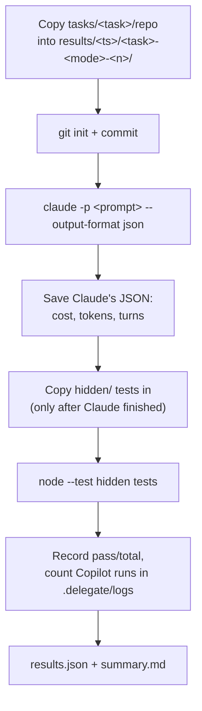
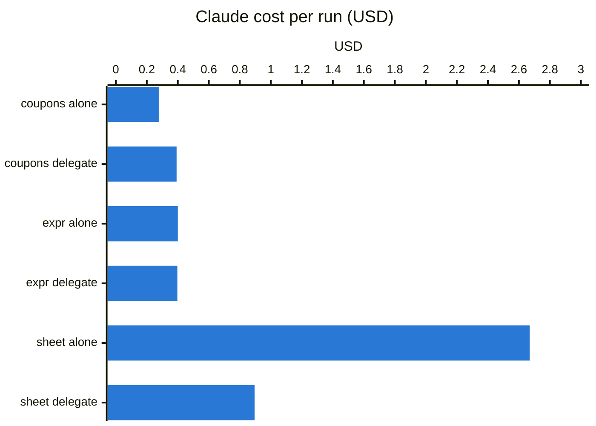

# Benchmark: Claude alone vs Claude + delegate

`bench/run.py` runs the same tasks in two modes and compares Claude's cost, tokens, time and quality.

| Mode | Prompt given to `claude -p` |
|---|---|
| `alone` | `Implement the task described in TASK.md in this repository. Verify your work before finishing.` |
| `delegate` | `/delegate Implement the task described in TASK.md in this repository.` |

Both modes use the same Claude model (your Claude Code default unless `--model` is given), the same
tools (`Bash Read Edit Write Glob Grep Skill`) and `--permission-mode acceptEdits`.

## How one run works



The hidden tests are copied in only after the agent is done, so neither mode can see them or
tailor the code to them. They measure whether the result actually meets the spec in `TASK.md`.

## Running it

```sh
python3 bench/run.py                                   # all tasks, both modes, 1 run each
python3 bench/run.py --tasks spreadsheet --runs 3      # more runs, less noise
python3 bench/run.py --modes delegate --jobs 2         # only one mode, 2 runs in parallel
python3 bench/run.py --model sonnet                    # a different Claude model for both modes
```

| Option | Default | Meaning |
|---|---|---|
| `--tasks` | all | task names under `bench/tasks/` |
| `--modes` | `alone delegate` | which modes to run |
| `--runs` | `1` | runs per task and mode |
| `--jobs` | `1` | parallel runs (timing gets noisier with more) |
| `--model` | Claude Code default | Claude model for both modes |
| `--timeout` | `2400` | seconds per Claude run |

Every run uses Claude usage, and every `delegate` run that delegates also uses Copilot credits.

## Output

`bench/results/<timestamp>/`:

| File | Content |
|---|---|
| `summary.md` | the comparison table and per-mode averages |
| `results.json` | one record per run (fields below) |
| `<task>-<mode>-<n>/` | the run's working copy: inspect with `git diff` |
| `<task>-<mode>-<n>.claude.json` | Claude's raw `--output-format json` result |
| `<task>-<mode>-<n>.hidden.tap` | hidden test output (TAP) |

| Field | Source |
|---|---|
| `cost_usd` | `total_cost_usd` from Claude (API-equivalent cost) |
| `input_tokens`, `cache_write_tokens`, `cache_read_tokens`, `output_tokens` | Claude's `usage` |
| `turns` | `num_turns` |
| `wall_seconds` | measured by the harness (includes waiting for Copilot) |
| `worker_runs` | number of `.delegate/logs/run-*.log` files |
| `hidden_passed`, `hidden_total` | parsed from the TAP output |
| `permission_denials` | tool calls Claude was not allowed to make |

## Tasks

| Task | Kind | Size of a typical solution | Hidden tests |
|---|---|---|---|
| `cart-coupons` | add a feature to an existing small codebase | ~60 lines | 9 |
| `expr-eval` | new module: arithmetic expression evaluator | ~200 lines | 13 |
| `spreadsheet` | new multi-module engine: parser, evaluator, dependency graph, cycles, row insertion, change events | ~1,000 lines | 42 |

Every task's hidden tests were validated against a reference implementation (kept out of the
repo) before being used.

## Results (2026-09-19, Opus 5, one run per mode)



| Task | Mode | Hidden tests | Claude cost | Output tokens | Cache read | Turns | Wall time | Copilot runs |
|---|---|---|---|---|---|---|---|---|
| cart-coupons | alone | 9/9 | $0.277 | 3,179 | 82,426 | 5 | 30s | 0 |
| cart-coupons | delegate | 9/9 | $0.392 | 4,780 | 148,985 | 6 | 81s | 1 |
| cart-coupons | delegate + size check | 9/9 | $0.318 | 2,738 | 146,777 | 7 | 31s | 0 |
| expr-eval | alone | 13/13 | $0.400 | 6,203 | 133,027 | 9 | 52s | 0 |
| expr-eval | delegate | 13/13 | $0.397 | 5,498 | 146,120 | 6 | 102s | 1 |
| spreadsheet | alone | 42/42 | $2.670 | 44,607 | 1,566,536 | 33 | 432s | 0 |
| spreadsheet | delegate | 42/42 | $0.895 | 17,562 | 253,526 | 10 | 513s | 1 |

What each run wrote (lines added):

| Run | Implementation | Tests |
|---|---|---|
| cart-coupons alone | 57 (Claude) | 48 |
| cart-coupons delegate | 64 (Copilot) | 111 (Claude) |
| expr-eval alone | 185 (Claude) | 67 |
| expr-eval delegate | 239 (Copilot) | 118 (Claude) |
| spreadsheet alone | 984 in 7 modules (Claude) | 249 |
| spreadsheet delegate | 1,196 in 5 modules (Copilot) | 402 (Claude) |

### Takeaways

- **Small tasks lose money:** the tests Claude writes are as big as the code it would have written.
  The size check fixes this by having Claude do small tasks itself.
- **Big tasks save a lot:** Claude's turns drop from 33 to 10, and each turn re-reads less context.
- **Quality was the same** in every run.
- **Delegation is slower** (Claude waits for Copilot) and Copilot credits are not counted here.

## Adding a task

```text
bench/tasks/<name>/
├── repo/            # starting project; must contain TASK.md and a package.json with a test script
│   └── TASK.md      # the spec both modes receive
└── hidden/          # *.test.js acceptance tests, importing from ../src/...
```

1. Write `repo/TASK.md` precisely enough that the hidden tests have exactly one correct answer.
2. Write the hidden tests in `hidden/*.test.js`. They run with `node --test` from the project root,
   so import from `../src/...`.
3. Validate them: build a reference solution in a temporary copy, copy `hidden/` in as `.hidden/`, and
   run `node --test .hidden/*.test.js`. Don't commit the reference solution to `repo/`.
4. Run `python3 bench/run.py --tasks <name>`.

The harness currently runs hidden tests with `node --test`. Tasks in other languages need a
different command in `run_one()` in `bench/run.py`.
